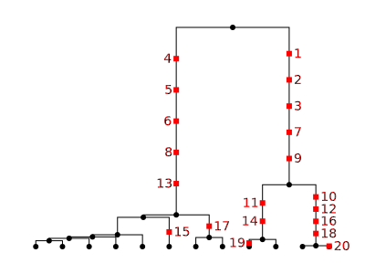
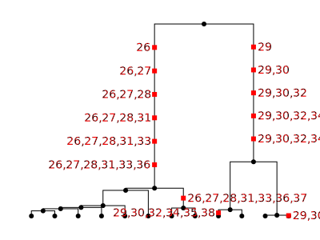
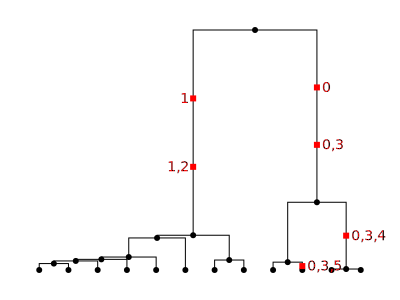
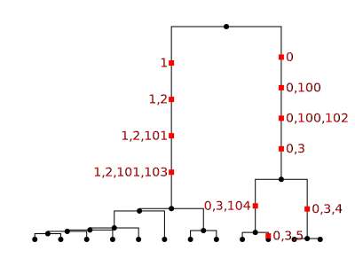

.. _sec_mutations:

====================
Simulating mutations
====================

.. todo::
    This has been copied directly from the api.rst file. Probably
    needs some refactoring to use the newer docs arrangements.

When running coalescent simulations it's usually most convenient to use the
``mutation_rate`` argument to the :func:`.simulate` function to throw neutral
mutations down on the trees. However, sometimes we wish to throw mutations
down on an existing tree sequence: for example, if we want to see the outcome
of different random mutational processes on top of a single simulated topology,
or if we have obtained the tree sequence from another program and wish to
overlay neutral mutations on this tree sequence.

***
API
***

.. autofunction:: msprime.mutate

.. _sec_api_mutation_models:

***************
Mutation Models
***************

Mutation models are specified using the ``model`` parameter to
:func:`.mutate`. This parameter can either take the form of a
string describing the model (e.g. ``model="jc69"``) or an instance of a
model definition class (e.g ``model=msprime.JC69MutationModel()``).
Here are the available models; they are documented in more detail below.

- :class:`.BinaryMutationModel`: 0/1 flip-flopping alleles
- :class:`.JC69MutationModel`: Jukes & Cantor '69, nucleotides
- :class:`.HKYMutationModel`: Hasegawa, Kishino & Yano '85, nucleotides
- :class:`.F84MutationModel`: Felsenstein '84, nucleotides
- :class:`.GTRMutationModel`: general time-reversible, nucleotides
- :class:`.BLOSUM62MutationModel`: amino acids
- :class:`.PAMMutationModel`: amino acids
- :class:`.MatrixMutationModel`: general finite-state mutations
- :class:`.InfiniteAllelesMutationModel`: a generic infinite-alleles model
- :class:`.SLiMMutationModel`: infinite-alleles model generating SLiM mutations

.. _sec_api_matrix_mutations_models:

++++++++++++++++++++++
Matrix Mutation Models
++++++++++++++++++++++

These classes are defined by an alphabet of possible alleles (`alleles`); an array of
probabilities that determines how likely each allele is to be the root, ancestral allele
(`root_distribution`); and a transition matrix specifying the probability for each allele
to mutate to every other allele. Each class has specific values of these parameters to
create the specific model. For your own custom model these parameters can be set using
:class:`msprime.MatrixMutationModel`. For more detail about how mutations are simulated
in these models see :ref:`sec_api_matrix_mutation_models_details`.

.. autoclass:: msprime.BinaryMutationModel()

.. autoclass:: msprime.JC69MutationModel()

.. autoclass:: msprime.HKYMutationModel()

.. autoclass:: msprime.F84MutationModel()

.. autoclass:: msprime.GTRMutationModel()

.. autoclass:: msprime.BLOSUM62MutationModel()

.. autoclass:: msprime.PAMMutationModel()

.. _sec_api_matrix_mutation_models_details:

++++++++++++++++++++++++++++++
Mutation Matrix Models Details
++++++++++++++++++++++++++++++

Mutation matrix models are specified by three things: an alphabet,
a root distribution, and a transition matrix.
These leave one free parameter: an overall mutation rate,
specified by the mutation ``rate`` in the call to :func:`.mutate`.
Concisely,
the underlying model of mutation is a continuous-time Markov chain on the alphabet,
started by a draw from ``root_distribution``, and
with instantaneous transition rate from ``i`` to ``j`` that is equal to
``rate`` multiplied by ``transition_matrix[i,j]``.
The ``root distribution`` and every row in the ``transition_matrix``
must give *probabilities*, i.e., they must be nonnegative numbers summing to 1.
For the precise interpretation of these parameters
(especially when the transition matrix has nonzero entries on the diagonal)
see :ref:`sec_api_matrix_mutation_theory`.

.. autoclass:: msprime.MatrixMutationModel()

You can define your own, but you probably don't need to:
there are several mutation matrix models already implemented in msprime,
using binary (0/1), nucleotide, or amino acid alphabets:

++++++++++++++++++++++++++++++++++++
Defining your own finite-sites model
++++++++++++++++++++++++++++++++++++

If you want to define your own :class:`.MatrixMutationModel`, you have a good
deal of freedom. For instance, here's a "decomposition/growth/disturbance"
mutation model, where the only possible transitions are 🎄 to 🔥, 🔥 to 💩, and
💩 to 🎄, with the first transition happening at one-fifth the rate of the
other two:

.. code-block:: python

   alleles = ["💩", "🎄", "🔥"]
   model = msprime.MatrixMutationModel(
       alleles,
       root_distribution = [1.0, 0.0, 0.0],
       transition_matrix = [[0.0, 1.0, 0.0],
                            [0.0, 0.8, 0.2],
                            [1.0, 0.0, 0.0]]
   )
   ts = msprime.simulate(12, Ne=10, random_seed=2, length=7)
   mts = msprime.mutate(ts, rate=2, random_seed=1, model=model, discrete=True)

We have simulated from this model at rate 2, so the overall rate of mutation
from 💩 to 🎄 and 🔥 to 💩 is 2, and from 🎄 to 🔥 is :math:`2 \times 0.2
= 0.4`. As a result, roughly 5/7th of the states will be 🎄, with the remainder
divided evenly between 💩 and 🔥. Here is the resulting "genotype matrix":

.. code-block::

   for v in mts.variants():
      print("".join(v.alleles[k] for k in v.genotypes))

   🔥🎄🎄🎄💩🎄🎄🎄🎄🎄🎄🎄
   💩💩💩🎄🎄🎄🎄💩🎄🎄🎄🎄
   🎄🎄🔥🔥💩🎄🎄🎄🎄🎄🎄🎄
   🎄🎄💩🔥🎄🎄🎄🎄💩💩🔥💩
   💩🎄🎄🎄🔥🎄🎄🎄🎄🎄🔥🎄
   🎄🎄🎄🎄🎄🎄🎄🎄🎄🎄🎄🎄
   💩🎄🎄🎄🎄💩🎄🎄🎄💩🎄💩

.. _sec_api_matrix_mutation_theory:

++++++++++++++++++++++++++++++++++++++++++
Parameterization of Matrix Mutation Models
++++++++++++++++++++++++++++++++++++++++++

Mutation matrix models are specified by three things: an alphabet,
a root distribution, and a transition matrix.
These leave one free parameter: an overall mutation rate,
specified by the mutation ``rate`` in the call to :func:`.mutate`.
Concisely,
the underlying model of mutation is a continuous-time Markov chain on the alphabet,
started by a draw from ``root_distribution``, and
with instantaneous transition rate from ``i`` to ``j`` that is equal to
``rate`` multiplied by ``transition_matrix[i,j]``.
The ``root distribution`` and every row in the ``transition_matrix``
must give *probabilities*, i.e., they must be nonnegative numbers summing to 1.

To interpret these parameters,
it helps to know how the underlying mutational process is implemented.
First, "possible" mutations are placed on the tree,
with a mean density equal to the ``rate``, per unit of time and sequence length.
If ``discrete=False`` then this is an infinite-sites model,
so each possible mutation occurs at a distinct location.
If ``discrete=True`` then at each integer position,
each branch of the tree at that position gets a Poisson number of mutations
with mean equal to ``rate`` multiplied by the length of the branch.
Next, each site that has a possible mutation is assigned an ancestral state,
i.e., the allele at the root of the tree at that position,
by drawing an allele from the probabilities in the ``root_distribution``.
Now, each possible mutation is examined, moving down the tree.
For each, a derived state is chosen using the probabilities given in the
row of the ``transition_matrix`` that corresponds to the "parental state",
i.e., the allele that this mutation will replace.
Importantly, if the chosen allele is the *same* as the parental allele,
no mutation is recorded (that's why they were called "possible mutations").
And, any site at which no mutations are recorded is not recorded either.

This arrangement is necessary to fully specify Markov models of mutation,
with a free "mutation rate" parameter.
However, there are some surprising consequences.
For instance, the distribution of ancestral alleles, across all sites,
is *not* necessarily equal to the root distribution.
This is because the root distribution gives the distribution of
"ancestral" alleles across the entire sequence,
but we only see the ancestral alleles at *mutated* sites,
and some alleles may have a higher mutation rate than others.
For instance, if we have

.. code-block:: python

   alleles = ["A", "C", "G", "T"]
   root_distribution = np.array([0.25, 0.25, 0.25, 0.25])
   transition_matrix = np.array([
      [0.25, 0.25, 0.25, 0.25],
      [ 0.3,  0.0,  0.4,  0.3],
      [ 0.3,  0.4,  0.0,  0.3],
      [0.25, 0.25, 0.25, 0.25]
   ])

then A and T alleles have a 25% lower mutation rate than do C and G alleles,
since 25% of the time that we consider mutating them, we leave them unchanged.
From the properties of the Poisson distribution,
the probability that a tree of total length :math:`T`
has no mutations at a given discrete site is :math:`\exp(-rT)`,
if mutations are put down at a rate of :math:`r`.
Suppose that a single tree of total length :math:`T = 1.5`
extends over many discrete sites,
and that mutations are placed on it at rate :math:`r = 2.0`.
Every site that is assigned a "C" or "G" ancestral allele is retained,
but of those sites that are assigned an "A" or "T",
some are not recorded in the resulting tree sequence.
The expected proportions of the ancestral states
across all sites is proportional to the root distribution
multiplied by the probability that at least one mutation is retained on the tree.
In this situation it can be computed as follows:

.. code-block:: python

   r = 2.0
   T = 1.5
   prob_mut = 1.0 - np.diag(transition_matrix)
   ancestral_state_distribution = root_distribution * (1 - exp(- r * T * prob_mut))
   ancestral_state_distribution /= sum(ancestral_state_distribution)

Two more facts about Markov chains are useful to interpret the statistics
of these mutation models.
First, suppose we have tabulated all mutations, and so for each pair of alleles
:math:`i` and :math:`j` we have the proportion of mutations that caused an :math:`i \to j` change.
If allele :math:`i` mutates to a different allele, the chance it mutates to allele :math:`j`
is proportional to ``transition_matrix[i,j]`` but excluding the diagonal (no-change) entry,
so is equal to ``transition_matrix[i,j] / (1 - transition_matrix[i,i])``.
Second, suppose that an ancestor carries allele :math:`i` at a given position.
The probability that her descendant some time :math:`t` in the future carries allele :math:`j` at that position
is given by a matrix exponential of
the scaled `infinitestimal rate matrix <https://en.wikipedia.org/wiki/Transition_rate_matrix>`_ of the Markov chain,
which can be computed as follows:

.. code-block:: python

   Q = (transition_matrix - np.eye(len(alleles)))
   Pt = scipy.linalg.expm(t * rate * Q)[i,j]

If the top of a branch of length :math:`t` has allele :math:`i`,
the bottom of the branch has allele :math:`j` with probability ``Pt[i,j]``.

.. _sec_api_mutation_infinite_alleles:

++++++++++++++++++++++++++++++++
Infinite Alleles Mutation Models
++++++++++++++++++++++++++++++++

You can also use a model of *infinite alleles* mutation: where each new mutation produces a unique,
never-before-seen allele. The underlying mutation model just assigns the derived state
to be a new integer every time a new mutation appears.
By default these integers start at zero, but a different starting point can be chosen,
with the ``start_allele`` argument.
It does this globally across all mutations, so that the first assigned allele will be ``start_allele``,
and if ``n`` alleles are assigned in total (across ancestral and derived states),
these will be the next ``n-1`` integers.
Many theoretical results are derived based on this mutation model (e.g., Ewens' sampling formula).

.. autoclass:: msprime.InfiniteAllelesMutationModel()

For instance, here we'll simulate with the infinite alleles model on a single tree,
and print the resulting tree, labeling each mutation with its derived state:

.. code-block:: python

   ts = msprime.simulate(12, random_seed=2, length=1)
   model = msprime.InfiniteAllelesMutationModel()
   mts = msprime.mutate(ts, rate=2, random_seed=1, model=model, discrete=True)
   t = mts.first()
   ml = {m.id: m.derived_state for m in mts.mutations()}
   t.draw_svg('infinite_alleles.svg', mutation_labels=ml, node_labels={}, size=(400, 300))

Apparently, there were 20 mutations at this site, but the alleles present in the population are
"13" (in five copies), "17" (in two copies), and one copy each of "14", "15", "19", and "20".

.. warning::

   Neither this nor the next infinite alleles mutation model check to see if the alleles
   they produce already exist at the mutated sites. So, if you are using these
   models to add mutations to an already-mutated tree sequence, it is up to you
   to set the starting allele appropriately, and to make sure the results make sense!

.. _sec_api_mutation_slim_mutations:

++++++++++++++
SLiM mutations
++++++++++++++

A special class of infinite alleles model is provided for use with `SLiM <https://messerlab.org/slim/>`_,
to agree with the underlying mutation model in SLiM.
As with the InfiniteAlleles model, it assigns each new mutation a unique integer,
by keeping track of the ``next_id`` and incrementing it each time a new mutation appears.

.. autoclass:: msprime.SLiMMutationModel()

This differs from the :class:`.InfiniteAllelesMutationmodel` because mutations
in SLiM can "stack": new mutations can add to the existing state, rather than
replacing the previous state. So, derived states are comma-separated lists of
mutation IDs, and the ancestral state is always the empty string. For instance,
if a new mutation with ID 5 occurs at a site, and then later another mutation
appears with ID 64, the sequence of alleles moving along this line of descent
would be `""`, then `"5"`, and finally `"5,64"`. Furthermore, the mutation
model adds SLiM metadata to each mutation, which records, among other things,
the SLiM mutation type of each mutation, and the selection coefficient (which
is always 0.0, since adding mutations in this way only makes sense if they are
neutral). For this reason, the model has one required parameter: the ``type``
of the mutation, a nonnegative integer. If, for instance, you specify
``type=1``, then the mutations in SLiM will be of type ``m1``. For more
information, and for how to modify the metadata (e.g., changing the selection
coefficients), see
`the pyslim documentation <https://pyslim.readthedocs.io/en/latest/>`_.
For instance,

.. code-block:: python

   model = msprime.SLiMMutationModel(type=1)
   mts = msprime.mutate(ts, rate=1, random_seed=1, model=model, discrete=True)
   t = mts.first()
   ml = {m.id: m.derived_state for m in mts.mutations()}
   t.draw_svg('slim_alleles.svg', mutation_labels=ml, node_labels={}, size=(400, 300))

The resulting alleles show how derived states are built:

The behavior of this mutation model when used to add mutations to a previously mutated
tree sequence can be subtle. Let's look at a simple example.
Here, we first lay down mutations of type 1, starting from ID 0:

.. code-block:: python

   model_1 = msprime.SLiMMutationModel(type=1)
   mts_1 = msprime.mutate(ts, rate=0.5, random_seed=2, model=model_1, discrete=True)
   t = mts_1.first()
   ml = {m.id: m.derived_state for m in mts_1.mutations()}
   t.draw_svg(f'slim_alleles_1.svg', mutation_labels=ml, node_labels={}, size=(400, 300))

Next, we lay down mutations of type 2.
These we assign starting from ID 100,
to make it easy to see which are which:
in general just need to make sure that we start at an ID greater than any
previously assigned.
Note the ``allow_ancestral=True`` parameter:
this would error, otherwise because we are adding mutations above existing ones.

.. code-block:: python

   model_2 = msprime.SLiMMutationModel(type=2, next_id=100)
   mts = msprime.mutate(mts_1, rate=0.5, random_seed=3, model=model_2, discrete=True,
                        keep=True, allow_ancestral=True)
   t = mts.first()
   ml = {m.id: m.derived_state for m in mts.mutations()}
   t.draw_svg(f'slim_alleles_12.svg', mutation_labels=ml, node_labels={}, size=(400, 300))

Note what has happened here: on the top branch on the right side of the tree,
with the first model we added two mutations: first a mutation with ID ``0``,
then a mutation with ID ``3``.
Then, with the second model, we added two more mutations to this same branch,
with IDs ``100`` and ``102``, between these two mutations.
These were added to mutation ``0``, obtaining alleles ``0,100`` and ``0,100,102``.
But then, moving down the branch, we come upon the mutation with ID ``3``.
This was already present in the tree sequence, so its derived state is not modified:
``0,3``. We can rationalize this, post-hoc, by saying that the type 1 mutation ``3``
has "erased" the type 2 mutations ``100`` and ``102``.
If you want a different arrangment,
you can go back and edit the derived states (and metadata) as you like.

.. _sec_mutations_rate:

****************
Specifying rates
****************

.. todo:: Documentation on the ``rate`` parameter with examples.

.. _sec_mutations_randomness:

**********************
Controlling randomness
**********************

.. todo:: Documentation on the ``seed` parameter with examples. Can
    link to the randomness section in ancstry.rst. Alternatively we
    don't bother with this section and just link to the ancestry.rst
    one from the ``seed`` parameter to mutate.

.. _sec_mutations_discrete:

**********************
Discrete or continuous
**********************

.. todo:: Examples of using the ``discrete`` argument.

.. _sec_mutations_time_span:

*********************
Restricting time span
*********************

.. todo:: Docs and examples for the start_time and end_time params.

.. _sec_mutations_existing:

******************
Existing mutations
******************

.. todo:: Docs and examples for what to do when you're adding mutations
    to a ts that already has mutations. Like what the
    ``kept_mutations_before_end_time`` parameter.

