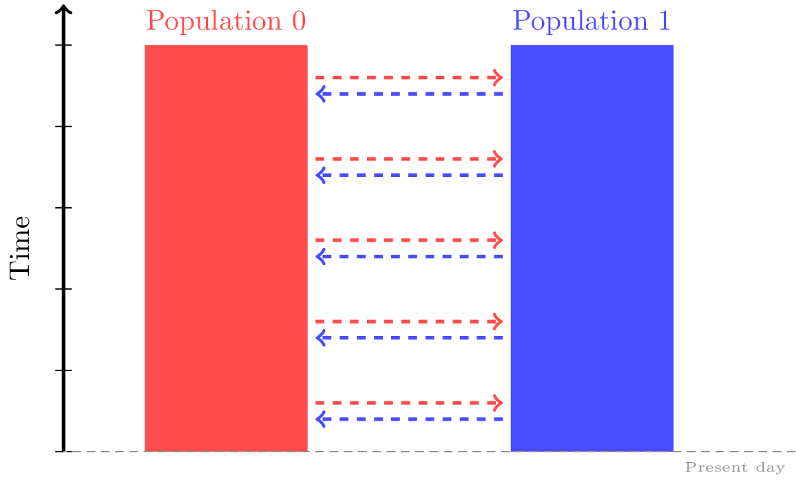
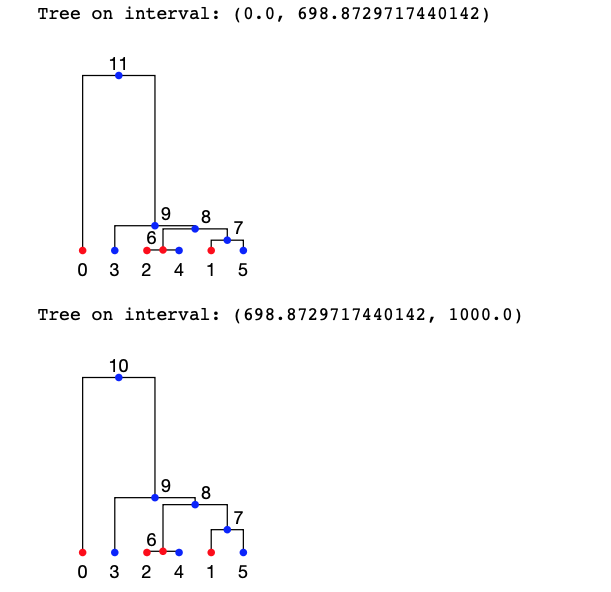
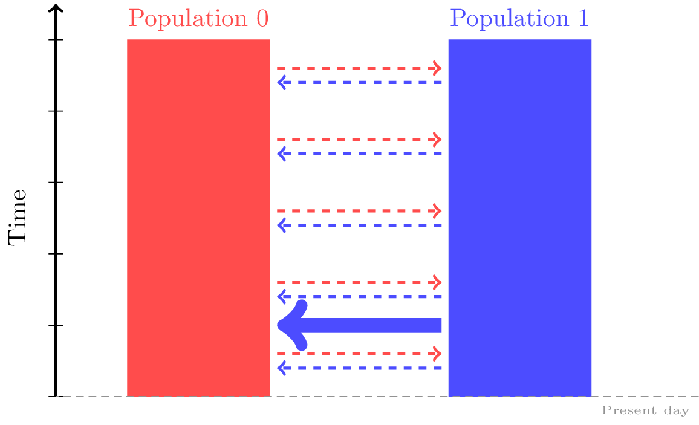
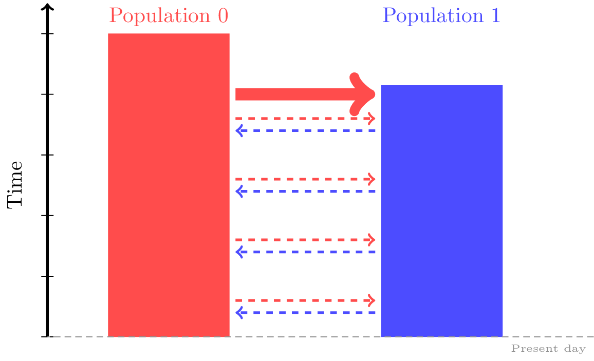
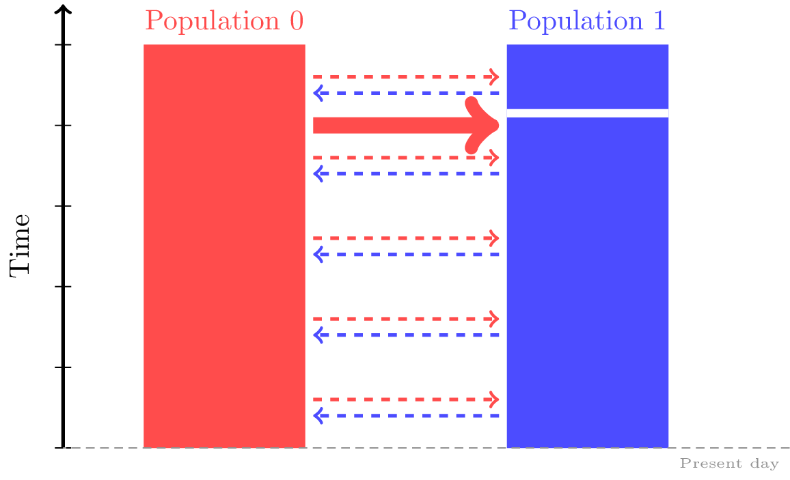
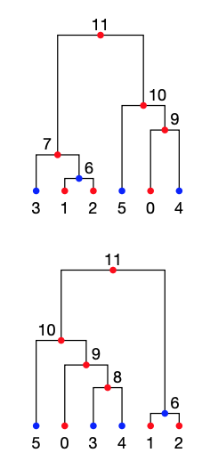
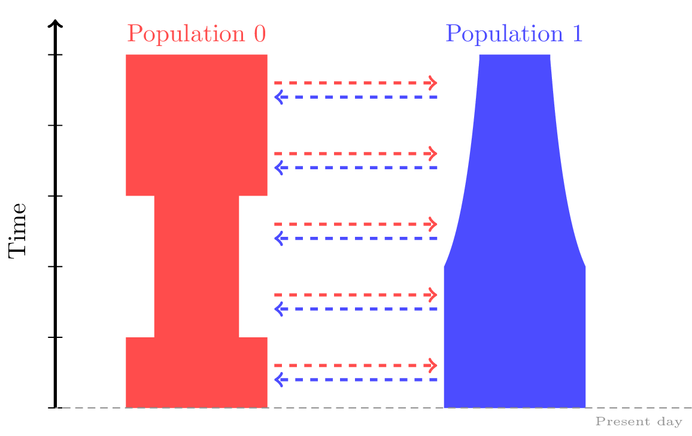

.. _sec_tutorial:

========
Tutorial
========

This is the tutorial for the Python interface to the ``msprime``
library. Detailed :ref:`sec_api` is also available for this
library. An :program:`ms` compatible :ref:`command line interface <sec_cli>`
is also available if you wish to use ``msprime`` directly within
an existing work flow.
Please see the `tskit documentation <https://tskit.readthedocs.io/en/stable>`_ for
more information on how to use the
`tskit Python API <https://tskit.readthedocs.io/en/stable/python-api.html>`_
to analyse simulation results.

If this is your first time using ``msprime``, head to the :ref:`sec_getting_started`
section to learn how to specify basic models of recombination and mutation.
Next, the :ref:`sec_demography` section will show you how to add demographic models
and population structure into your simulations.
The :ref:`sec_advanced_features` section covers more specific
features of ``msprime``, including ancient sampling,
hybrid forward-backward histories and full ARG recording.

.. _sec_getting_started:

Getting started
***************

***********************************
Tree sequences - the data structure
***********************************

``msprime`` outputs simulated datasets in the *tree sequence* format.
This is an encoding of a complete genealogy for a sample of chromosomes at
each chromosomal location.
They offer a few benefits to population geneticists compared with
traditional genetic file formats:

 - They can store large simulated datasets extremely compactly. (Often many times smaller than VCFs for real-sized datasets!)
 - As they hold rich detail about the history of the sample, many important processes can be observed directly from the tree structure. So a tree sequence is often more informative than raw genotype/haplotype data, even though it is also more compact.
 - They can be queried and modified extremely quickly. This enables quick calculation of many important population `statistics <https://tskit.readthedocs.io/en/latest/stats.html>`_.

 If you've never dealt with tree sequences before, you may wish to read
 through some of the `documentation <https://tskit.readthedocs.io/en/latest/>`_
 for ``tskit``, a Python package with a
 bunch of useful tools for working with tree sequences.

****************
A basic example
****************

Running simulations is very straightforward in ``msprime``.
Here, we simulate the coalescent for a sample of size six
with an effective population size of 1000 diploids:

.. code-block:: python

    import msprime
    ts = msprime.simulate(sample_size=6, Ne=1000)

The ``msprime`` library uses
`tskit <https://tskit.readthedocs.io/en/stable>`_
to return the simulation result as a
:class:`tskit.TreeSequence` object.
This provides a very
efficient way to access the correlated trees in simulations
involving recombination.
Using the :attr:`tskit.TreeSequence.num_trees` attribute, we can see
that there is only a single tree in our simulated tree sequence:

.. code-block:: python

    print("Number of trees in tree sequence:", ts.num_trees)
    # 1

This is because we have not yet provided a value for the recombination rate, and it
defaults to zero.

We can access this tree using the :meth:`~tskit.TreeSequence.first`
method, and can draw a simple depiction of the tree to the terminal
using the :meth:`~tskit.Tree.draw` method:

.. code-block:: python

    tree = ts.first()
    print(tree.draw(format="unicode"))

    #     10
    #  ┏━━┻━┓
    #  ┃    9
    #  ┃  ┏━┻━┓
    #  8  ┃   ┃
    # ┏┻┓ ┃   ┃
    # ┃ ┃ ┃   7
    # ┃ ┃ ┃ ┏━┻┓
    # ┃ ┃ ┃ ┃  6
    # ┃ ┃ ┃ ┃ ┏┻┓
    # 3 5 0 4 1 2

************
Random seeds
************

In general, running the same ``msprime`` commands multiple times will produce
different outputs. To ensure the same output every time, you can specify a random seed
using the ``random_seed`` argument.

.. code-block:: python

    ts = msprime.simulate(sample_size = 6, random_seed = 184)

***************
Sequence length
***************

Because we haven't yet specified a sequence length, our simulated
sequence will have length 1:

.. code-block:: python

    ts.sequence_length
    # 1.0

It is usually most convenient to set the sequence length to be
the number of nucleotide bases in the desired simulated sequence.
We use the ``length`` argument to specify this:

.. code-block:: python

	ts = msprime.simulate(sample_size = 6, random_seed = 1, length = 1000)
	print(ts.sequence_length)
	# 1000.0

*************************
Effective population size
*************************

Recall that each tree sequence has an equivalent representation as
a set of tables. Let's have a look at one of these tables now:

.. code-block:: python

    print(ts.tables.nodes)

    # id  flags   population  individual  time    metadata
    # 0   1   0   -1  0.00000000000000
    # 1   1   0   -1  0.00000000000000
    # 2   1   0   -1  0.00000000000000
    # 3   1   0   -1  0.00000000000000
    # 4   1   0   -1  0.00000000000000
    # 5   1   0   -1  0.00000000000000
    # 6   0   0   -1  0.07194744353492
    # 7   0   0   -1  0.61124301112428
    # 8   0   0   -1  0.73124726040958
    # 9   0   0   -1  0.91078323219376
    # 10  0   0   -1  1.32301250012150

The first six nodes with time=0.0 correspond to the samples.
All other nodes correspond to ancestors of the samples, and so have positive times.

.. note::

    The 'time' of a node records how long ago the node was born.
    Since ``msprime`` is a coalescent simulator, it looks "backwards in time",
    i.e., all 'time' attributes in ``msprime`` are measured in units of *time
    ago*.

The reason why the node times in our simple example are so small is because, by default,
``msprime`` assumes a constant (diploid) effective population size of Ne = 1,
which is equivalent to measuring time in units of Ne generations.

While this scaling can be useful when comparing simulations against analytic results
from coalescent theory, it's often simpler to think of time in units of generations
backwards-in-time. We can do this by specifying our desired
effective population size using the ``Ne`` input into simulate:

.. code-block:: python

    ts = msprime.simulate(sample_size = 6, random_seed = 1, Ne = 10000)
    print(ts.tables.nodes)

    # id  flags   population  individual  time    metadata
    # 0   1   0   -1  0.00000000000000
    # 1   1   0   -1  0.00000000000000
    # 2   1   0   -1  0.00000000000000
    # 3   1   0   -1  0.00000000000000
    # 4   1   0   -1  0.00000000000000
    # 5   1   0   -1  0.00000000000000
    # 6   0   0   -1  719.47443534915067
    # 7   0   0   -1  6112.43011124283566
    # 8   0   0   -1  7312.47260409581213
    # 9   0   0   -1  9107.83232193760159
    # 10  0   0   -1  13230.12500121500307

Recall that under the coalescent model, each simulated ancestral node represents a
coalescence event at which two lineages converge. These coalescences should occur less
frequently in a larger population. As expected, rescaling our effective population
size has also rescaled our coalescence times by the same factor!

Hopefully, you can already see that simulations with ``msprime`` can
help us clarify our intuition about how the coalescent model works.

*************
Recombination
*************

Simulating the history of a single locus is a very useful, but we are most
often interested in simulating the history of our sample across large genomic
regions that are under the influence of recombination. The ``msprime`` API is
specifically designed to make this easy and efficient,
and supports both uniform and variable models of recombination.

By default, recombination in ``msprime`` is simulated under an **infinite sites model**.
The ``sequence_length`` parameter is a floating point number, so recombination (and mutation) can
occur at any location along the sequence.
To learn how to use a **finite sites** model instead, see the
:ref:`sec_finite_site_recomb` section.

Uniform recombination
---------------------

To simulate with a uniform recombination rate, we specify two extra inputs to
:meth:`msprime.simulate`: a ``sequence_length``, usually specified as a number of bases,
and a ``recombination_rate``, specified as the rate of crossovers per unit of
length per generation.

Here, we simulate a tree sequence across over a 10kb region with a recombination
rate of :math:`2 \times 10^{-8}` per base per generation, and with a diploid
effective population size of 1000:

.. code-block:: python

    ts = msprime.simulate(
        sample_size=6, Ne=1000, length=1e4, recombination_rate=2e-8)

We'll then use the :meth:`tskit.TreeSequence.trees`
method to iterate over the trees in the sequence. For each tree
we print out its index (i.e., its position in the sequence) and
the interval the tree covers (i.e., the genomic
coordinates which all share precisely this tree) using the
:attr:`index <tskit.Tree.index>` and :attr:`interval <tskit.Tree.interval>` attributes:

.. code-block:: python

    for tree in ts.trees():
        print("-" * 20)
        print("tree {}: interval = {}".format(tree.index, tree.interval))
        print(tree.draw(format="unicode"))

    # --------------------
    # tree 0: interval = (0.0,  6016.224463474058)
    #    11
    # ┏━━┻━━┓
    # ┃     10
    # ┃  ┏━━┻━┓
    # ┃  ┃    9
    # ┃  ┃  ┏━┻┓
    # ┃  7  ┃  ┃
    # ┃ ┏┻┓ ┃  ┃
    # ┃ ┃ ┃ ┃  6
    # ┃ ┃ ┃ ┃ ┏┻┓
    # 3 0 1 2 4 5
    #
    # --------------------
    # tree 1: interval = (6016.224463474058, 10000.0)
    #      10
    #   ┏━━┻━━┓
    #   9     ┃
    # ┏━┻┓    ┃
    # ┃  ┃    8
    # ┃  ┃  ┏━┻┓
    # ┃  ┃  ┃  7
    # ┃  ┃  ┃ ┏┻┓
    # ┃  6  ┃ ┃ ┃
    # ┃ ┏┻┓ ┃ ┃ ┃
    # 2 4 5 3 0 1

Thus, the first tree covers the
first 6kb of sequence and the second tree covers the remaining 4kb.
We can see
that these trees share a great deal of their structure, but that there are
also important differences between the trees.

.. warning:: Do not store the values returned from the
    :meth:`~tskit.TreeSequence.trees` iterator in a list and operate
    on them afterwards! For efficiency reasons ``tskit`` uses the same
    instance of :class:`tskit.Tree` for each tree in the sequence
    and updates the internal state for each new tree. Therefore, if you store
    the trees returned from the iterator in a list, they will all refer
    to the same tree.

Non-uniform recombination
-------------------------

The ``msprime`` API allows us to quickly and easily simulate data from an
arbitrary recombination map.
To do this, we can specify an external recombination map as a
:meth:`msprime.RecombinationMap` object.
We need to supply a list of ``positions`` in the map, and a list showing ``rates``
of crossover between each specified position.

In the example below, we specify a recombination map with distinct recombination rates between each 100th base.

.. code-block:: python

    # Making a simple RecombinationMap object.
    map_positions = [i*100 for i in range(0, 11)]
    map_rates = [0, 1e-4, 5e-4, 1e-4, 0, 0, 0, 5e-4, 6e-4, 1e-4, 0]
    my_map = msprime.RecombinationMap(map_positions, map_rates)
    # Simulating with the recombination map.
    ts = msprime.simulate(sample_size = 6, random_seed = 12, recombination_map = my_map)

The resulting tree sequence has no interval breakpoints between positions 400 and 700,
as our recombination map specified a crossover rate of 0 between these positions.

.. code-block:: python

    for tree in ts.trees():
        print("-" * 20)
        print("tree {}: interval = {}".format(tree.index, tree.interval))
        print(tree.draw(format="unicode"))

    # --------------------
    # tree 0: interval = (0.0, 249.0639823488891)
    #    11
    #  ┏━━┻━━┓
    #  ┃     9
    #  ┃   ┏━┻━┓
    #  8   ┃   ┃
    # ┏┻┓  ┃   ┃
    # ┃ ┃  ┃   7
    # ┃ ┃  ┃  ┏┻┓
    # ┃ ┃  6  ┃ ┃
    # ┃ ┃ ┏┻┓ ┃ ┃
    # 2 5 0 1 3 4
    #
    # --------------------
    # tree 1: interval = (249.0639823488891, 849.2285335049714)
    #    12
    # ┏━━━┻━━━┓
    # ┃      11
    # ┃    ┏━━┻━┓
    # ┃    9    ┃
    # ┃  ┏━┻━┓  ┃
    # ┃  ┃   7  ┃
    # ┃  ┃  ┏┻┓ ┃
    # ┃  6  ┃ ┃ ┃
    # ┃ ┏┻┓ ┃ ┃ ┃
    # 5 0 1 3 4 2
    #
    # --------------------
    # tree 2: interval = (849.2285335049714, 1000.0)
    #   12
    # ┏━━┻━━┓
    # ┃    11
    # ┃  ┏━━┻━┓
    # ┃  ┃   10
    # ┃  ┃  ┏━┻┓
    # ┃  ┃  ┃  7
    # ┃  ┃  ┃ ┏┻┓
    # ┃  6  ┃ ┃ ┃
    # ┃ ┏┻┓ ┃ ┃ ┃
    # 5 0 1 2 3 4

A more advanced example is included below.
In this example we read a recombination
map for human chromosome 22, and simulate a single replicate. After
the simulation is completed, we plot histograms of the recombination
rates and the simulated breakpoints. These show that density of
breakpoints follows the recombination rate closely.

.. code-block:: python

    import numpy as np
    import scipy.stats
    import matplotlib.pyplot as pyplot

    def variable_recomb_example():
        infile = "hapmap/genetic_map_GRCh37_chr22.txt"
        # Read in the recombination map using the read_hapmap method,
        recomb_map = msprime.RecombinationMap.read_hapmap(infile)

        # Now we get the positions and rates from the recombination
        # map and plot these using 500 bins.
        positions = np.array(recomb_map.get_positions()[1:])
        rates = np.array(recomb_map.get_rates()[1:])
        num_bins = 500
        v, bin_edges, _ = scipy.stats.binned_statistic(
            positions, rates, bins=num_bins)
        x = bin_edges[:-1][np.logical_not(np.isnan(v))]
        y = v[np.logical_not(np.isnan(v))]
        fig, ax1 = pyplot.subplots(figsize=(16, 6))
        ax1.plot(x, y, color="blue")
        ax1.set_ylabel("Recombination rate")
        ax1.set_xlabel("Chromosome position")

        # Now we run the simulation for this map. We simulate
        # 50 diploids (100 sampled genomes) in a population with Ne=10^4.
        tree_sequence = msprime.simulate(
            sample_size=100,
            Ne=10**4,
            recombination_map=recomb_map)
        # Now plot the density of breakpoints along the chromosome
        breakpoints = np.array(list(tree_sequence.breakpoints()))
        ax2 = ax1.twinx()
        v, bin_edges = np.histogram(breakpoints, num_bins, density=True)
        ax2.plot(bin_edges[:-1], v, color="green")
        ax2.set_ylabel("Breakpoint density")
        ax2.set_xlim(1.5e7, 5.3e7)
        fig.savefig("hapmap_chr22.svg")

.. image:: _static/hapmap_chr22.svg
   :width: 800px
   :alt: Density of breakpoints along the chromosome.

.. _sec_finite_site_recomb:

Finite-site recombination
-------------------------

.. todo::
	Add this.

*********
Mutations
*********

Mutations are generated in ``msprime`` by throwing mutations down
on the branches of trees at a particular rate.

Infinite sites mutations
------------------------

By default, the mutations are
generated under the infinite sites model, and so each mutation
occurs at a unique (floating point) point position along the
genomic interval occupied by a tree. The mutation rate for simulations
is specified using the ``mutation_rate`` parameter of
:func:`.simulate`. For example, the following chunk simulates 50kb
of nonrecombining sequence with a mutation rate of :math:`1 \times 10^{-8}`
per base per generation:

.. code-block:: python

    ts = msprime.simulate(
       sample_size=6, Ne=1000, length=50e3, mutation_rate=1e-8, random_seed=30)
    tree = ts.first()
    for site in tree.sites():
        for mutation in site.mutations:
            print("Mutation @ position {:.2f} over node {}".format(
                site.position, mutation.node))

    # Mutation @ position 1556.54 over node 9
    # Mutation @ position 4485.17 over node 6
    # Mutation @ position 9788.56 over node 6
    # Mutation @ position 11759.03 over node 6
    # Mutation @ position 11949.32 over node 6
    # Mutation @ position 14321.77 over node 9
    # Mutation @ position 31454.99 over node 6
    # Mutation @ position 45125.69 over node 9
    # Mutation @ position 49709.68 over node 6

    print(tree.draw(format="unicode"))

    #     10
    #  ┏━━┻━━┓
    #  ┃     9
    #  ┃   ┏━┻━┓
    #  ┃   ┃   8
    #  ┃   ┃  ┏┻┓
    #  ┃   7  ┃ ┃
    #  ┃  ┏┻┓ ┃ ┃
    #  6  ┃ ┃ ┃ ┃
    # ┏┻┓ ┃ ┃ ┃ ┃
    # 0 4 2 5 1 3

It is also possible to add mutations to an existing tree sequence
using the :func:`msprime.mutate` function.

Finite sites mutations
----------------------

.. todo::
    Add details about simulating mutations under a finite sites model.

********
Variants
********

We are often interesting in accessing the sequence data that results from
simulations directly. The most efficient way to do this is by using
the :meth:`tskit.TreeSequence.variants` method, which returns an iterator
over all the :class:`tskit.Variant` objects arising from the trees and mutations.
Each variant contains a reference to the site object, as well as the
alleles and the observed sequences for each sample in the ``genotypes`` field.

In the following example we loop through each variant in a simulated
dataset. We print the observed state of each sample,
along with the index and position of the corresponding mutation:

.. code-block:: python

    ts = msprime.simulate(
        sample_size=20, Ne=1e4, length=5e3, recombination_rate=2e-8,
        mutation_rate=2e-8, random_seed=10)
    for variant in ts.variants():
        print(
            variant.site.id, variant.site.position,
            variant.alleles, variant.genotypes, sep="\t")

    # 0       2432.768327416852       ('0', '1')      [0 0 0 0 0 0 0 0 1 0 0 0 0 0 0 0 0 0 0 0]
    # 1       2577.6939414924095      ('0', '1')      [1 0 1 1 1 1 0 1 1 1 1 1 1 1 1 1 1 1 1 1]
    # 2       2844.682702049562       ('0', '1')      [0 0 0 1 1 0 0 0 0 0 0 0 0 0 0 0 0 1 0 0]
    # 3       4784.266628557816       ('0', '1')      [0 0 0 0 0 0 0 0 1 0 0 0 0 0 0 0 0 0 0 0]

Note that ``variant.alleles[variant.genotypes[j]]`` gives the allele
of sample ID ``j`` at variant ``variant``.
In this example, the
alleles are always ``'0'`` (the ancestral state) and ``'1'``
(the derived state), because we are simulating with the infinite sites mutation
model, in which each mutation occurs at a unique position in the genome.
More complex models are possible, however.

This way of working with the sequence data is quite efficient because we
do not need to store all the sample genotypes at all variant sites in memory at once.
However, if we do want the full genotype matrix as a numpy array,
it is simple to obtain:

.. code-block:: python

    A = ts.genotype_matrix()
    A

    # array([[0, 0, 0, 0, 0, 0, 0, 0, 1, 0, 0, 0, 0, 0, 0, 0, 0, 0, 0, 0],
    #        [1, 0, 1, 1, 1, 1, 0, 1, 1, 1, 1, 1, 1, 1, 1, 1, 1, 1, 1, 1],
    #        [0, 0, 0, 1, 1, 0, 0, 0, 0, 0, 0, 0, 0, 0, 0, 0, 0, 1, 0, 0],
    #          [0, 0, 0, 0, 0, 0, 0, 0, 1, 0, 0, 0, 0, 0, 0, 0, 0, 0, 0, 0]], dtype=uint8)

This is useful for integrating with tools such as
`scikit allel <https://scikit-allel.readthedocs.io/en/latest/>`_,
but note that what we call a genotype matrix corresponds to a
scikit-allel haplotype array.

.. warning::
    Beware that this matrix might be very big (bigger than the tree
    sequence it's extracted from, in most realistically-sized
    simulations!)

.. _sec_demography:

Demography
**********

So far, we've been simulating samples from a single population of a constant size,
which isn't particularly exciting!
One of the strengths of msprime is that it can be used to specify quite complicated
models of demography and population history with a simple Python API.

.. note::

    A lot of the material in this section was first presented in a workshop
    at the SMBE Speciation meeting in June 2019.
    You can download the exercises as a standalone Jupyter notebook over
    `here <https://github.com/DRL/SMBE-SGE-2019/blob/master/Session_1/2.Introduction_to_msprime.ipynb>`_,
    or run the exercises in an online binder session by following the instructions at the bottom of
    `this page <https://github.com/DRL/SMBE-SGE-2019>`_.

********************
Population structure
********************

``msprime`` supports simulation from multiple discrete populations,
each of which is initialized with a :meth:`msprime.PopulationConfiguration` object.
For each population, you can specify a sample size, an effective population size
at time = 0 and an exponential growth rate.

.. note::

    Population structure in ``msprime`` closely follows the model used in the
    ``ms`` simulator.
    Unlike ``ms`` however, all times and rates are specified
    in generations and all populations sizes are absolute (that is, not
    multiples of :math:`N_e`).

Suppose we wanted to simulate three sequences each from two populations
with a constant effective population size of 500.

.. code-block:: python

    pop0 = msprime.PopulationConfiguration(sample_size=3, initial_size = 500)
    pop1 = msprime.PopulationConfiguration(sample_size=3, initial_size = 500)

You can give these to :meth:`msprime.simulate` as a list
using the ``population_configurations`` argument.
(Note that we no longer need to specify ``Ne`` as we have provided a separate size for each population).

.. code-block:: python

    # ts = msprime.simulate(population_configurations = [pop0, pop1],
    #       random_seed = 12, length = 1000, recombination_rate = 1e-4,
    #       mutation_rate = 7e-4)

However, **this simulation will run forever** unless we also
specify some migration between the groups!
To understand why, recall that ``msprime`` is a `coalescent`-based simulator.
The simulation will run backwards-in-time, simulating until `all` samples have
coalesced to a single common ancestor at each genomic location.
However, with no migration between our two populations, samples in one
population will never coalesce with samples in another population.
To fix this, let's add some migration events to the specific demographic history.

**********
Migrations
**********

With msprime, you can specify continual rates of migrations between
populations, as well as one-off mass migrations.

Constant migration
------------------

Migration rates between the populations can be specified as the elements of an
*N* by *N* numpy array, and given to :meth:`msprime.simulate` via the
``migration_matrix`` argument. The diagonal elements of this array must each be
0, and the *(i, j)* th element specifies the expected number of migrants moving
from population *j* to population *i* per generation, divided by the size of
population *i*.  When this rate is small (close to 0), it is approximately
equal to the fraction of population *i* that consists of new migrants from
population *j* in each generation.

For instance, the following migration matrix specifies that in each generation,
approximately 5% of population 0 consists of migrants from population 1, and
approximately 2% of population 1 consists of migrants from population 0.

.. code-block:: python

    M = np.array([
    [0, 0.05],
    [0.02, 0]])

    ts = msprime.simulate(
            population_configurations = [pop0, pop1],
            migration_matrix = M,
            length = 1000,
            random_seed = 17,
            recombination_rate = 1e-7)

One consequence of specifying :meth:`msprime.PopulationConfiguration` objects
is that each of the simulated nodes will now belong to one of our specified
populations:

.. code-block:: python

    print(ts.tables.nodes)

    # id  flags   population  individual  time    metadata
    # 0   1   0   -1  0.00000000000000
    # 1   1   0   -1  0.00000000000000
    # 2   1   0   -1  0.00000000000000
    # 3   1   1   -1  0.00000000000000
    # 4   1   1   -1  0.00000000000000
    # 5   1   1   -1  0.00000000000000
    # 6   0   0   -1  11.88714489632197
    # 7   0   1   -1  224.72850970133027
    # 8   0   1   -1  471.21813561520798
    # 9   0   1   -1  539.93458624531195
    # 10  0   1   -1  1723.16029992759240
    # 11  0   1   -1  3813.34990584180423

Notice that the ``population`` column of the node table now contains values of 0 and 1.
If you are working in a Jupyter notebook, you can draw the tree sequence
with nodes coloured by population label using SVG:

.. code-block:: python

    from IPython.display import SVG

    colour_map = {0:"red", 1:"blue"}
    node_colours = {u.id: colour_map[u.population] for u in ts.nodes()}
    for tree in ts.trees():
        print("Tree on interval:", tree.interval)
        # The code below will only work in a Jupyter notebook with SVG output enabled.
        display(SVG(tree.draw(node_colours=node_colours)))

More coalescences are happening in population 1 than population 0.
This makes sense given that population 1 is specifying more migrants to
population 0 than vice versa.

Changing migration rates
------------------------

We can change any of the migration rates at any time in the simulation.
To do this, we just need to add a :meth:`msprime.MigrationRateChange` object
specifying the index of the migration matrix to be changed,
the time of the change and the new migration rate.

For instance, say we wanted to specify that in each generation prior to
time = 100, 1% of population 0 consisted of migrants from population 1.

.. code-block:: python

    migration_rate_change = msprime.MigrationRateChange(
                time = 100, rate = 0.01, matrix_index=(0, 1))

A list of these changes can be supplied to :meth:`msprime.simulate` via the
``demographic_events`` input:
(If there is more than 1 change, ensure they are ordered by backwards-time!)

.. code-block:: python

    ts = msprime.simulate(
            population_configurations = [pop0, pop1],
            migration_matrix = M,
            length = 1000,
            demographic_events = [migration_rate_change],
            random_seed = 25,
            recombination_rate = 1e-6)

Mass migrations
---------------

:meth:`msprime.MassMigration` objects are used to specify one-off events in which some fraction of a population moves into another population. These are useful for specifying divergence and admixture events.

You'll need to provide the time of the event in generations,
the ID of the source and destination populations,
and a migration proportion (which defaults to 1.0).
For example, the following specifies that 50 generations ago,
30% of population 0 was a migrant from population 1.

.. code-block:: python

    admixture_event  = msprime.MassMigration(time = 50, source = 0, dest = 1, proportion = 0.3)

Note that these are viewed as backwards-in-time events,
so ``source`` is the population that receives migrants from ``dest``.

Any mass migrations can be added into the list of ``demographic_events`` supplied to :meth:`msprime.simulate`.

.. code-block:: python

    ts = msprime.simulate(
            population_configurations = [pop0, pop1],
            migration_matrix = M,
            demographic_events = [admixture_event],
            random_seed = 12,
            length = 1000,
            recombination_rate = 1e-4,
            mutation_rate = 7e-4)

:meth:`msprime.MassMigration` objects can also be used to specify divergence events, but we must take some care.

The following specifies that 200 generations ago, 100% of population 1 was a migrant from population 0.

.. code-block:: python

    divergence_event = msprime.MassMigration(
            time = 200, source = 1, dest = 0, proportion = 1)

We'll add this to our list of demographic_events.

.. code-block:: python

    ts = msprime.simulate(
            population_configurations = [pop0, pop1],
            migration_matrix = M,
            demographic_events = [admixture_event, divergence_event],
            random_seed = 28,
            length = 1000,
            recombination_rate = 1e-7)

However, when we look at the population IDs corresponding to the the nodes from more than 200 generations ago, there are still some nodes from both populations. This is not what what we'd expect to see if we'd correctly simulated a divergence event!

.. code-block:: python

    [u.population for u in ts.nodes() if u.time > 200]
    # [1, 0, 1, 1]

The reason is that at present, we are simulating a situation in which population 1 exists prior to generation 200, but is completely replaced by migrants from population 0 at time = 200. And because we've specified a migration matrix, there will still be some migrants from population 0 to population 1 in prior generations.

We can fix this by also specifying that prior to time = 200, population 1 had no migration from population 0.

.. code-block:: python

    rate_change = msprime.MigrationRateChange(
        time = 200, rate = 0, matrix_index=None)

    ts = msprime.simulate(
            population_configurations = [pop0, pop1],
            migration_matrix = M,
            demographic_events = [admixture_event, divergence_event, rate_change],
            random_seed = 28,
            length = 1000,
            recombination_rate = 1e-7)

Now all ancestral nodes prior to generation 200 are exclusively from population 0. Hooray!

.. code-block:: python

    [u.population for u in ts.nodes() if u.time > 200]
    # [0, 0, 0, 0, 0]

    # This only works in a Jupyter notebook.
    from IPython.display import SVG

    colour_map = {0:"red", 1:"blue"}
    node_colours = {u.id: colour_map[u.population] for u in ts.nodes()}
    for tree in ts.trees():
        display(SVG(tree.draw(node_colours=node_colours)))

*****************************************
Changing population sizes or growth rates
*****************************************

We may wish to specify changes to rates of population growth,
or sudden changes in population size at a particular time.
Both of these can be specified with :meth:`msprime.PopulationParametersChange`
objects in the supplied list of ``demographic_events``.

.. code-block:: python

    # Bottleneck in Population 0 between 50 - 150 generations ago.
    pop0_bottleneck_ends = msprime.PopulationParametersChange(
        time = 50, initial_size = 250, population = 0)
    pop0_bottleneck_starts = msprime.PopulationParametersChange(
        time = 150, initial_size = 500, population = 0)

    # Exponential growth in Population 1 starting 50 generations ago.
    pop1_growth = msprime.PopulationParametersChange(
        time = 100, growth_rate = 0.01, population = 1)

    ts = msprime.simulate(
            population_configurations = [pop0, pop1],
            migration_matrix = M,
            length = 1000,
            demographic_events = [pop0_bottleneck_ends, pop1_growth, pop0_bottleneck_starts],
            random_seed = 17,
            recombination_rate = 1e-6)

.. note::

    Since ``msprime`` simulates backwards-in-time, parameter changes must be
    interpreted backwards-in-time as well.
    For instance, the ``pop1_growth`` event in the example above
    specifies continual growth in the early history of population 1 up until 100
    generations in the past.

.. _sec_tutorial_demography_census:

*************
Census events
*************

Census events allow you to add a node to each branch of the tree sequence at a given time
during the simulation. This can be useful when you wish to study haplotypes that are
ancestral to your simulated sample, or when you wish to know which lineages were present in
which populations at specified times.

For instance, the following code specifies a simulation with two samples drawn from each of
two populations. There are two demographic events: a migration rate change and a census
event. At generation 100 and earlier, the two populations exchange migrants at a rate of
0.05. At generation 5000, a census is performed:

.. code-block:: python

    pop_config = msprime.PopulationConfiguration(sample_size=2, initial_size=1000)
    mig_rate_change = msprime.MigrationRateChange(time=100, rate=0.05)
    ts = msprime.simulate(
                population_configurations=[pop_config, pop_config],
                length=1000,
                demographic_events=[mig_rate_change, msprime.CensusEvent(time=5000)],
                recombination_rate=1e-7,
                random_seed=141)

The resulting tree sequence has nodes on each tree at the specified census time.
These are the nodes with IDs 8, 9, 10, 11, 12 and 13:

.. code-block:: python

    # This will only work in a Jupyter notebook
    from IPython.display import SVG
    display(SVG(ts.draw_svg()))

This tells us that the genetic material ancestral to the present day sample was held within 5 haplotypes at time 5000. The node table shows us that four of these haplotypes (nodes 8, 9, 10 and 11) were in population 0 at this time, and two of these haplotypes (nodes 12 and 13) were in population 1 at this time.

.. code-block:: python

    print(ts.tables.nodes)

    # id  flags   population  individual  time    metadata
    # 0   1       0   -1  0.00000000000000
    # 1   1       0   -1  0.00000000000000
    # 2   1       1   -1  0.00000000000000
    # 3   1       1   -1  0.00000000000000
    # 4   0       1   -1  2350.08685279051815
    # 5   0       1   -1  3759.20387382847684
    # 6   0       0   -1  4234.97992185234671
    # 7   0       1   -1  4598.83898042243527
    # 8   1048576 0   -1  5000.00000000000000
    # 9   1048576 0   -1  5000.00000000000000
    # 10  1048576 0   -1  5000.00000000000000
    # 11  1048576 0   -1  5000.00000000000000
    # 12  1048576 1   -1  5000.00000000000000
    # 13  1048576 1   -1  5000.00000000000000
    # 14  0       1   -1  5246.90282987397495
    # 15  0       0   -1  8206.73121309170347

If we wish to study these ancestral haplotypes further, we can simplify the tree sequence
with respect to the census nodes and perform subsequent analyses on this simplified tree
sequence.
In this example, ``ts_anc`` is a tree sequence obtained from the original tree sequence
``ts`` by labelling the census nodes as samples and removing all nodes and edges that are
not ancestral to these census nodes.

.. code-block:: python

    nodes = [i.id for i in ts.nodes() if i.flags==msprime.NODE_IS_CEN_EVENT]
    ts_anc = ts.simplify(samples=nodes)

********************
Debugging demography
********************

As we've seen, it's pretty easy to make mistakes when specifying demography!

To help you spot these, msprime provides a debugger that prints out your
population history in a more human-readable form.
It's good to get into the habit of running the :meth:`msprime.DemographyDebugger`
before running your simulations.

.. code-block:: python

    my_history = msprime.DemographyDebugger(
    population_configurations=[pop0, pop1], migration_matrix = M,
    demographic_events=[admixture_event, divergence_event, rate_change])

    my_history.print_history()

    # Model =  hudson(reference_size=1)
    # ============================
    # Epoch: 0 -- 50.0 generations
    # ============================
    #      start     end      growth_rate |     0        1
    #    -------- --------       -------- | -------- --------
    # 0 |   500      500                0 |     0      0.05
    # 1 |   500      500                0 |   0.02       0
    #
    # Events @ generation 50.0
    #    - Mass migration: Lineages moved with probability 0.3 backwards in time with source 0 & dest 1
    #                      (equivalent to migration from 1 to 0 forwards in time)
    # ================================
    # Epoch: 50.0 -- 200.0 generations
    # ================================
    #      start     end      growth_rate |     0        1
    #    -------- --------       -------- | -------- --------
    # 0 |   500      500                0 |     0      0.05
    # 1 |   500      500                0 |   0.02       0
    #
    # Events @ generation 200.0
    #    - Mass migration: Lineages moved with probability 1 backwards in time with source 1 & dest 0
    #                      (equivalent to migration from 0 to 1 forwards in time)
    #    - Migration rate change to 0 everywhere
    # ===============================
    # Epoch: 200.0 -- inf generations
    # ===============================
    #      start     end      growth_rate |     0        1
    #    -------- --------       -------- | -------- --------
    # 0 |   500      500                0 |     0        0
    # 1 |   500      500                0 |     0        0

.. _sec_tutorial_demography_complete_example:

******************
A complete example
******************

To illustrate ``msprime``'s demography API on a real example from the
literature, we implement the
`Gutenkunst et al. <http://dx.doi.org/10.1371/journal.pgen.1000695>`_
out-of-Africa model.
The parameter values used are taken from
`Table 1 <http://dx.doi.org/10.1371/journal.pgen.1000695.t001>`_.
Here is an illustration of the model using the `demography
package <https://github.com/apragsdale/demography>`__
(see also `Figure 2B <http://dx.doi.org/10.1371/journal.pgen.1000695.g002>`_
of the Gutenkunst et. al paper):

.. image:: _static/Gutenkunst_OOA_diagram.svg
   :width: 500px
   :align: center
   :alt: Schematic of Gutenkunst et al. (2009) out-of-Africa model.

The code below is provided as an example to help you develop your
own models. If you want to use this precise model in your analyses
we strongly recommend using :ref:`stdpopsim <stdpopsim:sec_introduction>`,
which provides a community maintained :ref:`catalog <stdpopsim:sec_catalog>`
of simulation species information and demographic models. The
model given here is identical to the
:ref:`HomSam/OutOfAfrica_3G09 <stdpopsim:sec_catalog_homsap_models_outofafrica_3g09>`
model.

.. warning::

    The version of this model in the tutorial from 31 May 2016 to 29 May 2020
    (on the stable branch) was **incorrect**. Specifically, it mistakenly
    allowed for migration to continue beyond the merger of the African and
    Eurasian bottleneck populations. This has now been fixed, but if you had
    copied this model from the tutorial for your own analyses, you should
    update your model code or use the implementation that has been verified in
    :ref:`stdpopsim project <stdpopsim:sec_introduction>`. See `here
    <https://github.com/jeromekelleher/msprime-model-errors>`__ for more
    details on the faulty model and its likely effects on downstream analyses.

Coalescent simulation moves from the present back into the past,
so times are in units of generations *ago*, and we build the model
with most recent events first.

.. literalinclude:: examples/out_of_africa.py

Once we have defined the model, it is a *very* good idea to check
the implementation using the :class:`.DemographyDebugger`:

.. code-block:: python

    # Use the demography debugger to print out the demographic history
    # that we have just described.
    dd = msprime.DemographyDebugger(**out_of_africa())
    dd.print_history()

    # =============================
    # Epoch: 0 -- 848.0 generations
    # =============================
    #      start     end      growth_rate |     0        1        2
    #    -------- --------       -------- | -------- -------- --------
    # 0 |1.23e+04 1.23e+04              0 |     0      3e-05   1.9e-05
    # 1 |2.97e+04   1e+03           0.004 |   3e-05      0     9.6e-05
    # 2 |5.41e+04    510           0.0055 |  1.9e-05  9.6e-05     0
    #
    # Events @ generation 848.0
    #    - Mass migration: Lineages moved with probability 1.0 backwards in time with source 2 & dest 1
    #                      (equivalent to migration from 1 to 2 forwards in time)
    #    - Migration rate change to 0 everywhere
    #    - Migration rate change for (0, 1) to 0.00025
    #    - Migration rate change for (1, 0) to 0.00025
    #    - Population parameter change for 1: initial_size -> 2100 growth_rate -> 0
    # ==================================
    # Epoch: 848.0 -- 5600.0 generations
    # ==================================
    #      start     end      growth_rate |     0        1        2
    #    -------- --------       -------- | -------- -------- --------
    # 0 |1.23e+04 1.23e+04              0 |     0     0.00025     0
    # 1 | 2.1e+03  2.1e+03              0 |  0.00025     0        0
    # 2 |   510   2.27e-09         0.0055 |     0        0        0
    #
    # Events @ generation 5600.0
    #    - Mass migration: Lineages moved with probability 1.0 backwards in time with source 1 & dest 0
    #                    (equivalent to migration from 0 to 1 forwards in time)
    #    - Migration rate change to 0 everywhere
    # ===================================
    # Epoch: 5600.0 -- 8800.0 generations
    # ===================================
    #      start     end      growth_rate |     0        1        2
    #    -------- --------       -------- | -------- -------- --------
    # 0 |1.23e+04 1.23e+04              0 |     0        0        0
    # 1 | 2.1e+03  2.1e+03              0 |     0        0        0
    # 2 |2.27e-09 5.17e-17         0.0055 |     0        0        0
    #
    # Events @ generation 8800.0
    #    - Population parameter change for 0: initial_size -> 7300
    # ================================
    # Epoch: 8800.0 -- inf generations
    # ================================
    #      start     end      growth_rate |     0        1        2
    #    -------- --------       -------- | -------- -------- --------
    # 0 | 7.3e+03  7.3e+03              0 |     0        0        0
    # 1 | 2.1e+03  2.1e+03              0 |     0        0        0
    # 2 |5.17e-17     0            0.0055 |     0        0        0

Once you are satisfied that the demographic history that you have built
is correct, it can then be simulated by calling the :func:`.simulate`
function:

.. code-block:: python

    ts = msprime.simulate(**out_of_africa())

.. _sec_advanced_features:

Advanced features
*****************

.. _sec_advanced_features_logging:

*******
Logging
*******

Msprime uses the Python :mod:`logging` infrastructure to help debugging
complex simulations. Messages at the INFO level are high-level information
about the state of the current simulation, such as switches in simulation
model, etc. While it is straightforward to set up logging messages using
the built-in Python methods, the `daiquiri
<https://daiquiri.readthedocs.io/en/latest/>`_ is a bit more convenient.
For example,

.. literalinclude:: examples/logging_info.py

Running this code we would get output something like the following:

.. code-block:: none

    2020-06-24 16:02:20,983 [11188] INFO     msprime.ancestry: Running model {'name': 'dtwf'} until max time: 100.000000
    2020-06-24 16:02:20,984 [11188] INFO     msprime.ancestry: Running model {'name': 'hudson'} until max time: inf
    2020-06-24 16:02:20,984 [11188] INFO     msprime.ancestry: Completed at time=1449.4 nodes=19 edges=18

When running larger simulations and trying to figure out when
they might finish, it can be helpful to use the DEBUG logging output.
For example,

.. literalinclude:: examples/logging_debug.py

which gives us:

.. code-block:: none

    2020-06-24 16:11:33,373 [11729] INFO     msprime.ancestry: Running model {'name': 'hudson'} until max time: inf
    2020-06-24 16:11:33,396 [11729] DEBUG    msprime.ancestry: time=0.0444792 ancestors=90162
    2020-06-24 16:11:33,418 [11729] DEBUG    msprime.ancestry: time=0.0979881 ancestors=80314
    2020-06-24 16:11:33,438 [11729] DEBUG    msprime.ancestry: time=0.167461 ancestors=70518
    2020-06-24 16:11:33,466 [11729] DEBUG    msprime.ancestry: time=0.258912 ancestors=60734
    2020-06-24 16:11:33,501 [11729] DEBUG    msprime.ancestry: time=0.386571 ancestors=51002
    2020-06-24 16:11:33,542 [11729] DEBUG    msprime.ancestry: time=0.575475 ancestors=41292
    2020-06-24 16:11:33,596 [11729] DEBUG    msprime.ancestry: time=0.872121 ancestors=31704
    2020-06-24 16:11:33,668 [11729] DEBUG    msprime.ancestry: time=1.42071 ancestors=22228
    2020-06-24 16:11:33,763 [11729] DEBUG    msprime.ancestry: time=2.75437 ancestors=13042
    2020-06-24 16:11:33,906 [11729] DEBUG    msprime.ancestry: time=8.80469 ancestors=4752
    2020-06-24 16:11:34,018 [11729] DEBUG    msprime.ancestry: time=277.713 ancestors=416
    2020-06-24 16:11:34,034 [11729] DEBUG    msprime.ancestry: time=6352.95 ancestors=142
    2020-06-24 16:11:34,042 [11729] DEBUG    msprime.ancestry: time=20955.5 ancestors=104
    2020-06-24 16:11:34,050 [11729] DEBUG    msprime.ancestry: time=40321.8 ancestors=83
    2020-06-24 16:11:34,056 [11729] DEBUG    msprime.ancestry: time=72735.7 ancestors=74
    2020-06-24 16:11:34,059 [11729] INFO     msprime.ancestry: Completed at time=235063 nodes=207110 edges=233940

In this example we run a reasonably large simulation and turn on
the DEBUG output. This will then periodically (every 10,000 simulation
events) print out the current time in the simulation, and the
number of extant ancestral lineages.

.. warning:: The format of these logging messages is not fixed and may change
    arbitrarily in the future. If you need to obtain the information within
    them, please open an issue on GitHub so that we can provide a documented
    API for this.

*********************
Parsing species trees
*********************

Models used in ``msprime`` for simulation can be designed to approximate the
diversification history of a group of diverging species, by defining, for each species
divergence, a mass migration event at which all lineages from one population move
into another population. To faciliate the specification of these mass migration events
it is possible to parse a species tree and generate the set of mass migration events
automatically.

To be parseable, a species tree must be encoded in
`Newick <https://en.wikipedia.org/wiki/Newick_format>`_ format, with named leaves and
branch lengths. One example of a parseable species tree in Newick format is
``(((human:5.6,chimpanzee:5.6):3.0,gorilla:8.6):9.4,orangutan:18.0)``. When visualized
in a software like `FigTree <http://tree.bio.ed.ac.uk/software/figtree/>`_, this tree
appears as shown below:

In the above figure, numbers written on branches indicate the lengths of these branches.
In this case, the units of the branch lengths are millions of years, which is common
for species trees; however, trees with branch lengths in units of years or generations
can also be parsed. When the branch lengths are in units of millions of years or in units
of years (i.e., not in units of generations), a generation time in number of years must
be provided so that the simulation model can be set up. In addition, a population size
is required. With the species tree, a generation time, and the population size, the model
can be generated:

.. code-block:: python

    import msprime
    pop_configs, demographic_events = msprime.parse_species_tree(
            tree="(((human:5.6,chimpanzee:5.6):3.0,gorilla:8.6):9.4,orangutan:18.0)",
            Ne=10000,
            branch_length_units="myr",
            generation_time=28)

The ``parse_species_tree()`` method returns a tuple of two lists:

.. code-block:: python

    print(type(pop_configs))
    # <class 'list'>
    print(type(demographic_events))
    # <class 'list'>

The first of these two lists contains instances of :class:`.PopulationConfiguration` and
the second contains instances of :class:`.MassMigration`:

.. code-block:: python

    print(type(pop_configs[0]))
    # <class 'msprime.simulations.PopulationConfiguration'>
    print(type(demographic_events[0]))
    # <class 'msprime.simulations.MassMigration'>

The mass migration events are ordered by the time of the event and they thus specify
the sequence in which lineages are moved from source to destination populations:

.. code-block:: python

    print(demographic_events[0])
    # Mass migration: Lineages moved with probability 1.0 backwards in time with source 1 & dest 0
                         (equivalent to migration from 0 to 1 forwards in time)
    print(demographic_events[1])
    # Mass migration: Lineages moved with probability 1.0 backwards in time with source 2 & dest 0
                         (equivalent to migration from 0 to 2 forwards in time)
    print(demographic_events[2])
    # Mass migration: Lineages moved with probability 1.0 backwards in time with source 3 & dest 0
                         (equivalent to migration from 0 to 3 forwards in time)

The above output indicates that --- viewed backwards in time --- lineages from
populations 1, 2, and 3 are consecutively moved into population 0. Viewed forwards in
time instead, this means that population 3 is the first to diverge, followed by
population 2 and finally the divergence between populations 0 and 1. This
sequence of divergences corresponds to the species tree if population 3 is orangutan
and populations 2, 1, and 0 are gorilla, chimpanzee, and human, respectively. While
the parsed species names are not used as population labels, they are included in the
population configurations in the form of metadata, with the "species_name" tag:

.. code-block:: python

    print([pop_config.metadata for pop_config in pop_configs])
    # [{'species_name': 'human'}, {'species_name': 'chimpanzee'}, {'species_name': 'gorilla'}, {'species_name': 'orangutan'}]

As the above output shows, the information on the topology of the species tree is
fully included in the set of population configurations and mass migration events.
It also illustrates that it is always the left one (when viewed from the root
towards the tips of the species tree in the tree figure above) of the two populations
descending from a divergence event that is used as the destination population in
mass migration events.

The population configurations also define the population size:

.. code-block:: python

    print([pop_config.initial_size for pop_config in pop_configs])
    # [10000.0, 10000.0, 10000.0, 10000.0]

The population size is 10,000 because this value was specified for Ne when
calling :func:`.parse_species_tree`. The growth rates are zero for all populations,
meaning that they all have constant population sizes:

.. code-block:: python

    print([pop_config.growth_rate for pop_config in pop_configs])
    # [0.0, 0.0, 0.0, 0.0]

To simulate under the model corresponding to the species tree, the population
configurations and mass migration events are used as input for
:func:`.simulate`. We can specify the genomes to sample either by using the
``samples`` parameter or by setting a sample size for each population:

.. code-block:: python

    for pop_config in pop_configs:
        pop_config.sample_size = 2
    # pop_configs now has 2 genomes sampled from each population at time 0. Equivalent to
    # msprime.simulate(samples=[(0,0), (0,0), (1,0), (1,0), (2,0), (2,0), (3,0), (3,0)], ...)
    tree_sequence = msprime.simulate(
            population_configurations=pop_configs,
            demographic_events=demographic_events)
    tree = tree_sequence.first()
    print(tree.draw(format="unicode"))
    #    14
    #  ┏━━┻━━━┓
    #  ┃     13
    #  ┃   ┏━━┻━━┓
    #  ┃   ┃    12
    #  ┃   ┃   ┏━┻━┓
    #  ┃   ┃   ┃  11
    #  ┃   ┃   ┃  ┏┻┓
    # 10   ┃   ┃  ┃ ┃
    # ┏┻┓  ┃   ┃  ┃ ┃
    # ┃ ┃  ┃   9  ┃ ┃
    # ┃ ┃  ┃  ┏┻┓ ┃ ┃
    # ┃ ┃  8  ┃ ┃ ┃ ┃
    # ┃ ┃ ┏┻┓ ┃ ┃ ┃ ┃
    # 6 7 4 5 2 3 0 1

The correspondence between the model and the species tree can also be verified
by using the demography debugger:

.. code-block:: python

    dd = msprime.DemographyDebugger(
        population_configurations=pop_configs,
        demographic_events=demographic_events)
    dd.print_history()
    # Model =  hudson(reference_size=1)
    # ================================
    # Epoch: 0 -- 200000.0 generations
    # ================================
    #      start     end      growth_rate |     0        1        2        3
    #    -------- --------       -------- | -------- -------- -------- --------
    # 0 |  1e+04    1e+04               0 |     0        0        0        0
    # 1 |  1e+04    1e+04               0 |     0        0        0        0
    # 2 |  1e+04    1e+04               0 |     0        0        0        0
    # 3 |  1e+04    1e+04               0 |     0        0        0        0
    #
    # Events @ generation 200000.0
    #    - Mass migration: Lineages moved with probability 1.0 backwards in time with source 1 & dest 0
    #                      (equivalent to migration from 0 to 1 forwards in time)
    # =================================================
    # Epoch: 200000.0 -- 307142.85714285716 generations
    # =================================================
    #      start     end      growth_rate |     0        1        2        3
    #    -------- --------       -------- | -------- -------- -------- --------
    # 0 |  1e+04    1e+04               0 |     0        0        0        0
    # 1 |  1e+04    1e+04               0 |     0        0        0        0
    # 2 |  1e+04    1e+04               0 |     0        0        0        0
    # 3 |  1e+04    1e+04               0 |     0        0        0        0
    #
    # Events @ generation 307142.85714285716
    #    - Mass migration: Lineages moved with probability 1.0 backwards in time with source 2 & dest 0
    #                      (equivalent to migration from 0 to 2 forwards in time)
    # =========================================================
    # Epoch: 307142.85714285716 -- 642857.142857143 generations
    # =========================================================
    #      start     end      growth_rate |     0        1        2        3
    #    -------- --------       -------- | -------- -------- -------- --------
    # 0 |  1e+04    1e+04               0 |     0        0        0        0
    # 1 |  1e+04    1e+04               0 |     0        0        0        0
    # 2 |  1e+04    1e+04               0 |     0        0        0        0
    # 3 |  1e+04    1e+04               0 |     0        0        0        0
    #
    # Events @ generation 642857.142857143
    #    - Mass migration: Lineages moved with probability 1.0 backwards in time with source 3 & dest 0
    #                      (equivalent to migration from 0 to 3 forwards in time)
    # ==========================================
    # Epoch: 642857.142857143 -- inf generations
    # ==========================================
    #      start     end      growth_rate |     0        1        2        3
    #    -------- --------       -------- | -------- -------- -------- --------
    # 0 |  1e+04    1e+04               0 |     0        0        0        0
    # 1 |  1e+04    1e+04               0 |     0        0        0        0
    # 2 |  1e+04    1e+04               0 |     0        0        0        0
    # 3 |  1e+04    1e+04               0 |     0        0        0        0

The epoch boundaries 200000, 307142.9, and 642857.1 correspond to the species
divergence times 5.6, 8.6, and 18.0 after converting the branch length units
of the species tree from millions of years to generations with the specified
generation time of 28 years.

******************
Historical samples
******************

Simulating coalescent histories in which some of the samples are not
from the present time is straightforward in ``msprime``.
By using the ``samples`` argument to :meth:`msprime.simulate`
we can specify the location and time at which all samples are made.

.. code-block:: python

    def historical_samples_example():
        samples = [
            msprime.Sample(population=0, time=0),
            msprime.Sample(0, 0),  # Or, we can use positional arguments.
            msprime.Sample(0, 1.0),
            msprime.Sample(0, 1.0)
        ]
        tree_seq = msprime.simulate(samples=samples)
        tree = tree_seq.first()
        for u in tree.nodes():
            print(u, tree.parent(u), tree.time(u), sep="\t")
        print(tree.draw(format="unicode"))

In this example we create four samples, two taken at the present time
and two taken 1.0 generations in the past, as might represent one modern
and one ancient diploid individual. There are a number of
different ways in which we can describe the samples using the
``msprime.Sample`` object (samples can be provided as plain tuples also
if more convenient). Running this example, we get:

.. code-block:: python

    historical_samples_example()
    # 6    -1    2.8240255501413247
    # 4    6    0.0864109319103291
    # 0    4    0.0
    # 1    4    0.0
    # 5    6    1.9249243960710336
    # 2    5    1.0
    # 3    5    1.0
    #    6
    #  ┏━┻━┓
    #  ┃   5
    #  ┃  ┏┻┓
    #  ┃  2 3
    #  ┃
    #  4
    # ┏┻┓
    # 0 1

Because nodes ``0`` and ``1`` were sampled at time 0, their times in the tree
are both 0. Nodes ``2`` and ``3`` were sampled at time 1.0, and so their times are recorded
as 1.0 in the tree.

***********
Replication
***********

A common task for coalescent simulations is to check the accuracy of analytical
approximations to statistics of interest. To do this, we require many independent
replicates of a given simulation. ``msprime`` provides a simple and efficient
API for replication: by providing the ``num_replicates`` argument to the
:func:`.simulate` function, we can iterate over the replicates
in a straightforward manner. Here is an example where we compare the
analytical results for the number of segregating sites with simulations:

.. literalinclude:: examples/segregating_sites.py

Running this code, we get:

.. code-block:: python

    segregating_sites(10, 5, 100000)
    #          mean              variance
    # Observed      14.17893          53.0746740551
    # Analytical    14.14484          52.63903

Note that in this example we set :math:`N_e = 0.5` and
the mutation rate to :math:`\theta / 2` when calling :func:`.simulate`.
This works because ``msprime`` simulates Kingman's coalescent,
for which :math:`N_e` is only a time scaling;
since :math:`N_e` is the diploid effective population size,
setting :math:`N_e = 0.5` means that the mean time for two samples to coalesce
is equal to one time unit in the resulting trees.
This is helpful for converting the diploid per-generation time units
of msprime into the haploid coalescent units used in many
theoretical results. However, it is important to note that conventions
vary widely, and great care is needed with such factor-of-two
rescalings.

.. _sec_tutorial_multiple_chromosomes:

********************
Multiple chromosomes
********************

.. warning:: This approach is somewhat hacky; hopefully we will have a more
    elegant solution soon!

Multiple chromosomes can be simulated by specifying a recombination map with
hotspots between chromosomes. For example, to simulate two chromosomes each 1
Morgan in length:

.. code-block:: python

    rho = 1e-8
    positions = [0, 1e8-1, 1e8, 2e8-1]
    rates = [rho, 0.5, rho, 0]
    num_loci = int(positions[-1])

    recombination_map = msprime.RecombinationMap(
        positions=positions, rates=rates, num_loci=num_loci)

    tree_sequence = msprime.simulate(
        sample_size=100, Ne=1000, recombination_map=recombination_map,
        model="dtwf")

Care must be taken when simulating whole genomes this way, as the rescaling
required to model such large fluctuations in recombination rate can result in
the following error: ``Bad edge interval where right <= left``

This can be avoided by discretizing the genome into 100bp chunks by changing
the above to:

.. code-block:: python

    rho = 1e-8
    positions = [0, 1e8-1, 1e8, 2e8-1]
    rates = [rho, 0.5, rho, 0]
    num_loci = positions[-1] // 100 # Discretize into 100bp chunks

Also note that recombinations will still occur in the gaps between chromosomes,
with corresponding trees in the tree sequence. This will be fixed in a future
release.

.. _sec_tutorial_hybrid_simulations:

******************
Hybrid simulations
******************

In some situations Wright-Fisher simulations are desireable but less
computationally efficient than coalescent simulations, for example simulating a
small sample in a recently admixed population. In these cases, a hybrid model
offers an excellent tradeoff between simulation accuracy and performance.

This is done through a :class:`.SimulationModelChange` event, which is a special type of
demographic event.

For example, here we switch from the discrete-time Wright-Fisher model to the
standard Hudson coalescent 500 generations in the past:

.. code-block:: python

    ts = msprime.simulate(
        sample_size=6, Ne=1000, model="dtwf", random_seed=2,
        demographic_events=[
            msprime.SimulationModelChange(time=500, model="hudson")])
    print(ts.tables.nodes)
    # id      flags   population      individual      time    metadata
    # 0       1       0       -1      0.00000000000000
    # 1       1       0       -1      0.00000000000000
    # 2       1       0       -1      0.00000000000000
    # 3       1       0       -1      0.00000000000000
    # 4       1       0       -1      0.00000000000000
    # 5       1       0       -1      0.00000000000000
    # 6       0       0       -1      78.00000000000000
    # 7       0       0       -1      227.00000000000000
    # 8       0       0       -1      261.00000000000000
    # 9       0       0       -1      272.00000000000000
    #10      0       0       -1      1629.06982528980075

Because of the integer node times, we can see here that most of the coalescent
happened during the Wright-Fisher phase of the simulation, and as-of 500
generations in the past, there were only two lineages left. The continuous
time standard coalescent model was then used to simulate the ancient past of
these two lineages.

.. _sec_tutorial_simulate_from:

*******************************
Completing forwards simulations
*******************************

The ``msprime`` simulator generates tree sequences using the backwards in
time coalescent model. But it is also possible to output tree sequences
from `forwards-time <https://www.biorxiv.org/content/early/2018/01/16/248500>`_
simulators such as `SLiM <https://messerlab.org/slim/>`_.
There are many advantages to using forward-time simulators, but they
are usually quite slow compared to similar coalescent simulations. In this
section we show how to combine the best of both approaches by simulating
the recent past using a forwards-time simulator and then complete the
simulation of the ancient past using ``msprime``. (We sometimes refer to this
"recapitation", as we can think of it as adding a "head" onto a tree sequence.)

First, we define a simple Wright-Fisher simulator which returns a tree sequence
with the properties that we require (please see the :ref:`API <sec_api_simulate_from>`
section for a formal description of these properties):

.. literalinclude:: examples/wright_fisher.py

We then run a tiny forward simulation of 10 two-locus individuals
for 5 generations, and print out the resulting trees:

.. code-block:: python

    num_loci = 2
    N = 10
    wf_ts = wright_fisher(N, 5, L=num_loci, random_seed=3)
    for tree in wf_ts.trees():
        print("interval = ", tree.interval)
        print(tree.draw(format="unicode"))

We get::

    interval =  (0.0, 1.0)
           0                 7
           ┃                 ┃
           25                ┃
      ┏━━━━┻━━━━┓            ┃
      23        24           ┃
    ┏━┻━┓    ┏━━╋━━━┓        ┃
    ┃   21   ┃  ┃   22       20
    ┃  ┏┻━┓  ┃  ┃  ┏┻━┓   ┏━━╋━━┓
    10 14 19 11 18 15 17  12 13 16

    interval =  (1.0, 2.0)
            0          8    4     7
            ┃          ┃   ┏┻━┓   ┃
            21         ┃   ┃  ┃   ┃
    ┏━━┳━━┳━┻┳━━┳━━┓   ┃   ┃  ┃   ┃
    14 19 10 13 16 18  11  15 17  12

Because our Wright Fisher simulation ran for only 5 generations, there has not
been enough time for the trees to fully coalesce. Therefore, instead of having
one root, the trees have several --- the first tree has 2 and the second 4.
Nodes 0 to 9 in this simulation represent the initial population of the
simulation, and so we can see that all samples in the first tree trace back
to one of two individuals from the initial generation.
These unary branches joining samples and coalesced subtrees to the nodes
in the initial generation are essential as they allow use to correctly
assemble the various fragments of ancestral material into chromosomes
when creating the initial conditions for the coalescent simulation.
(Please see the :ref:`API <sec_api_simulate_from>` section for more details on the
required properties of input tree sequences.)

The process of completing this tree sequence using a coalescent simulation
begins by first examining the root segments on the input trees. We get the
following segments::

    [(0, 2, 0), (0, 2, 7), (1, 2, 8), (1, 2, 4)]

where each segment is a ``(left, right, node)`` tuple. As nodes 0 and 7 are
present in both trees, they have segments spanning both loci. Nodes 8 and 4 are
present only in the second tree, and so they have ancestral segments only for
the second locus. Note that this means that we do *not* simulate the ancestry
of the entire initial generation of the simulation, but rather the exact
minimum that we need in order to complete the ancestry of the current
generation. For instance, root ``8`` has not coalesced over the interval from
``1.0`` to ``2.0``, while root ``0`` has not coalesced over the entire segment
from ``0.0`` to ``2.0``.

We run the coalescent simulation to complete this tree sequence using the
``from_ts`` argument to :func:`.simulate`. Because we have simulated a
two locus system with a recombination rate of ``1 / num_loci`` per generation
in the Wright-Fisher model, we want to use the same system in the coalescent simulation.
To do this we create recombination map using the
:meth:`.RecombinationMap.uniform_map` class method to easily create a
discrete map with the required number of loci.
(Please see the :ref:`API <sec_api_simulate_from>` section for more details on the
restrictions on recombination maps when completing an existing simulation.)
We also use a ``Ne`` value of ``N / 2``
since the Wright-Fisher simulation was haploid and ``msprime`` is diploid.

.. code-block:: python

    recomb_map = msprime.RecombinationMap.uniform_map(num_loci, 1 / num_loci, num_loci)
    coalesced_ts = msprime.simulate(
        Ne=N / 2, from_ts=wf_ts, recombination_map=recomb_map, random_seed=5)

After running this simulation we get the following trees::

    interval =  (0.0, 1.0)
                    26
           ┏━━━━━━━━┻━━━━━━━┓
           0                7
           ┃                ┃
           25               ┃
      ┏━━━━┻━━━━┓           ┃
      23        24          ┃
    ┏━┻━┓    ┏━━╋━━━┓       ┃
    ┃   21   ┃  ┃   22      20
    ┃  ┏┻━┓  ┃  ┃  ┏┻━┓  ┏━━╋━━┓
    10 14 19 11 18 15 17 12 13 16

    interval =  (1.0, 2.0)
                      28
                 ┏━━━━┻━━━━━┓
                 ┃          27
                 ┃        ┏━┻━━┓
                 26       ┃    ┃
            ┏━━━━┻━━━━┓   ┃    ┃
            0         7   4    8
            ┃         ┃  ┏┻━┓  ┃
            21        ┃  ┃  ┃  ┃
    ┏━━┳━━┳━┻┳━━┳━━┓  ┃  ┃  ┃  ┃
    14 19 10 13 16 18 12 15 17 11

The trees have fully coalesced and we've successfully combined a forwards-time
Wright-Fisher simulation with a coalescent simulation: hooray!

Why record the initial generation?
-------------------------------------

We can now see why it is essential that the forwards simulator records the
*initial* generation in a tree sequence that will later be used as a
``from_ts`` argument to :func:`.simulate`. In the example above, if node
``7`` was not in the tree sequence, we would not know that the segment that
node ``20`` inherits from on ``[0.0, 1.0)`` and the segment that node ``12``
inherits from on ``[1.0, 2.0)`` both exist in the same node (here, node ``7``).

However, note that although the intial generation (above, nodes ``0``, ``4``,
``7``, and ``8``) must be in the tree sequence, they do *not* have to be
samples. The easiest way to do this is to
(a) retain the initial generation as samples throughout the forwards simulation
(so they persist through :meth:`~tskit.TableCollection.simplify`), but then (b) before we output
the final tree sequence, we remove the flags that mark them as samples,
so that :func:`.simulate` does not simulate their entire history as well. This
is the approach taken in the toy simulator provided above (although we skip
the periodic :meth:`~tskit.TableCollection.simplify` steps which are essential in any practical simulation
for simplicity).

-------------------------------------
Topology gotchas
-------------------------------------

The trees that we output from this combined forwards and backwards simulation
process have some slightly odd properties that are important to be aware of.
In the example above, we can see that the old roots are still present in both trees,
even through they have only one child and are clearly redundant.
This is because the tables of ``from_ts`` have been retained, without modification,
at the top of the tables of the output tree sequence. While this
redundancy is not important for many tasks, there are some cases where
they may cause problems:

1. When computing statistics on the number of nodes, edges or trees in a tree
   sequence, having these unary edges and redundant nodes will slightly
   inflate the values.
2. If you are computing the overall tree "height" by taking the time of the
   root node, you may overestimate the height because there is a unary edge
   above the "real" root (this would happen if one of the trees had already
   coalesced in the forwards-time simulation).

For these reasons it is usually better to remove this redundancy from your
computed tree sequence which is easily done using the
:meth:`tskit.TreeSequence.simplify` method:

.. code-block:: python

    final_ts = coalesced_ts.simplify()

    for tree in final_ts.trees():
        print("interval = ", tree.interval)
        print(tree.draw(format="unicode"))

giving us::

    interval =  (0.0, 1.0)
          17
      ┏━━━┻━━━━┓
      ┃        15
      ┃     ┏━━┻━━┓
      ┃     13    14
      ┃   ┏━┻┓  ┏━╋━━┓
      10  ┃  11 ┃ ┃  12
    ┏━╋━┓ ┃ ┏┻┓ ┃ ┃ ┏┻┓
    2 3 6 0 4 9 1 8 5 7

    interval =  (1.0, 2.0)
              19
        ┏━━━━━┻━━━━━┓
        ┃           18
        ┃         ┏━┻┓
        17        ┃  ┃
    ┏━━━┻━━┓      ┃  ┃
    ┃      ┃      ┃  16
    ┃      ┃      ┃ ┏┻┓
    ┃      11     ┃ ┃ ┃
    ┃ ┏━┳━┳┻┳━┳━┓ ┃ ┃ ┃
    2 4 9 0 3 6 8 1 5 7

This final tree sequence is topologically identical to the original tree sequence,
but has the redundant nodes and edges removed. Note also that he node IDs have been
reassigned so that the samples are 0 to 9 --- if you need the IDs from the original
tree sequence, please set ``map_nodes=True`` when calling ``simplify`` to get a
mapping between the two sets of IDs.

.. _sec_tutorial_record_full_arg:

**********************
Recording the full ARG
**********************

In ``msprime`` we usually want to simulate the coalescent with recombination
and represent the output as efficiently as possible. As a result, we don't
store individual recombination events, but rather their effects on the output
tree sequence. We also do not explicitly store common ancestor events that
do not result in marginal coalescences. For some purposes, however, we want
to get information on the full history of the simulation, not just the minimal
representation of its outcome. The ``record_full_arg`` option to
:func:`.simulate` provides this functionality, as illustrated in the following
example:

.. code-block:: python

    def full_arg_example():
        ts = msprime.simulate(
            sample_size=5, recombination_rate=0.1,
            record_full_arg=True, random_seed=42)
        print(ts.tables.nodes)
        print()
        for tree in ts.trees():
            print("interval:", tree.interval)
            print(tree.draw(format="unicode"))

Running this code we get::

    id      flags   population      individual      time    metadata
    0       1       0       -1      0.00000000000000
    1       1       0       -1      0.00000000000000
    2       1       0       -1      0.00000000000000
    3       1       0       -1      0.00000000000000
    4       1       0       -1      0.00000000000000
    5       0       0       -1      0.31846010419674
    6       0       0       -1      0.82270149120229
    7       0       0       -1      1.21622732856555
    8       131072  0       -1      1.51542116580501
    9       131072  0       -1      1.51542116580501
    10      262144  0       -1      2.12814260094490
    11      0       0       -1      2.16974122606933

    interval: (0.0, 0.7323522972251177)
          11
       ┏━━┻━┓
       ┃    10
       ┃    ┃
       ┃    8
       ┃    ┃
       7    ┃
     ┏━┻━┓  ┃
     ┃   6  ┃
     ┃  ┏┻┓ ┃
     5  ┃ ┃ ┃
    ┏┻┓ ┃ ┃ ┃
    0 4 2 3 1

    interval: (0.7323522972251177, 1.0)
          11
       ┏━━┻━┓
       ┃    10
       ┃    ┃
       ┃    9
       ┃    ┃
       7    ┃
     ┏━┻━┓  ┃
     ┃   6  ┃
     ┃  ┏┻┓ ┃
     5  ┃ ┃ ┃
    ┏┻┓ ┃ ┃ ┃
    0 4 2 3 1

After running the simulation we first print out the `node table
<https://tskit.readthedocs.io/en/stable/data-model.html#node-table>`_, which
contains information on all the nodes in the tree sequence. Note that ``flags``
column contains several different values: all of the sample nodes (at time 0)
have a flag value of ``1`` (:data:`tskit.NODE_IS_SAMPLE`). Other internal
nodes have a flag value of ``0``, which is the standard for internal nodes
in a coalescent simulations.

Nodes 8 and 9 have flags equal to 131072 (:data:`.NODE_IS_RE_EVENT`), which
tells us that they correspond to a recombination event in the ARG. A
recombination event results in two extra nodes being recorded, one identifying
the individual providing the genetic material to the left of the breakpoint and
the other identifying the individuals providing the genetic material to the
right. The effect of this extra node can be seen in the trees: node 8 is
present as a 'unary' node in the left hand tree and node 9 in the right.

Node 10 has a flags value of 262144 (:data:`.NODE_IS_CA_EVENT`), which
tells us that it is an ARG common ancestor event that *did not* result
in marginal coalescence. This class of event also results in unary nodes
in the trees, which we can see in the example.

If we wish to reduce these trees down to the minimal representation, we can
use :meth:`tskit.TreeSequence.simplify`. The resulting tree sequence will have
all of these unary nodes removed and will be equivalent to (but not identical, due to
stochastic effects) calling :func:`.simulate` without the ``record_full_arg``
argument.

Migrations nodes are also recording in the ARG using the
:data:`.NODE_IS_MIG_EVENT` flag. See the :ref:`sec_api_node_flags`
section for more details.

**********************
Evaluating likelihoods
**********************

``msprime`` can be used to evaluate the sampling probability of a tree sequence
for a given effective population size and per-site, per-generation recombination
rate, as well as the probability of a configuration of infinite sites mutations
given a tree sequence and a per-site, per-generation mutation probability. In
both cases, the tree sequence must conform to the ``record_full_arg`` option of
the :func:`.simulate` function. The following example illustrates the evaluation
of these log likelihoods:

.. code-block:: python

    def likelihood_example():
        ts = msprime.simulate(
            sample_size=5, recombination_rate=0.1, mutation_rate=0.1,
            record_full_arg=True, random_seed=42)
        print(msprime.log_arg_likelihood(ts, recombination_rate=0.1, Ne=1))
        print(msprime.log_arg_likelihood(ts, recombination_rate=1, Ne=1))
        print(msprime.log_arg_likelihood(ts, recombination_rate=1, Ne=10))
        print(msprime.unnormalised_log_mutation_likelihood(ts, mu=0))
        print(msprime.unnormalised_log_mutation_likelihood(ts, mu=0.1))
        print(msprime.unnormalised_log_mutation_likelihood(ts, mu=1))

Running this code we get::

    -11.22279995534112
    -14.947399100839986
    -22.154011926066893
    -inf
    -5.665181028073889
    -7.087195080578711

.. _sec_tutorial_multiple_mergers:

***************************
Multiple merger coalescents
***************************

``msprime`` can simulate several multiple merger coalescent models,
in which any number of lineages can coalesce in a number of simultaneous
mergers. These models are often appropriate when the distribution of
offspring numbers among individuals in the population is highly skewed.
The two provided models are the Beta-coalescent and the Dirac-coalescent.

The diploid Beta-Xi-coalescent can be simulated as follows:

.. code-block:: python

    def beta_multiple_merger_example():
        ts = msprime.sim_ancestry(
            sample_size=5, ploidy=2, random_seed=1,
            model=msprime.BetaCoalescent(alpha=1.001, truncation_point=1))
        tree = ts.first()
        print(tree.draw(format="unicode"))

Running this code, we get::

         16
     ┏━━━━┻━━━┓
     ┃       15
     ┃    ┏━━━┻━━━┓
     ┃    ┃      14
     ┃    ┃     ┏━┻━┓
    12    ┃     ┃  13
    ┏┻┓   ┃     ┃ ┏━╋━┓
    ┃ ┃  11     ┃ ┃ ┃ ┃
    ┃ ┃ ┏━┻━┓   ┃ ┃ ┃ ┃
    ┃ ┃ ┃  10   ┃ ┃ ┃ ┃
    ┃ ┃ ┃ ┏━╋━┓ ┃ ┃ ┃ ┃
    8 9 2 0 4 6 1 3 5 7

The specified value of :math:`\alpha = 1.001` corresponds to a heavily skewed
offspring distribution. Values closer to :math:`\alpha = 2` result in trees
whose distribution is closer to that of the standard coalescent, often featuring
no multiple mergers for small sample sizes:

.. code-block:: python

    def beta_few_multiple_mergers_example():
        ts = msprime.sim_ancestry(
            sample_size=5, ploidy=2, random_seed=1,
            model=msprime.BetaCoalescent(alpha=1.8, truncation_point=1))
        tree = ts.first()
        print(tree.draw(format="unicode"))

Running this code, we get::

         18
      ┏━━━┻━━━┓
      ┃      17
      ┃     ┏━┻━┓
     16     ┃   ┃
    ┏━┻━┓   ┃   ┃
    ┃   ┃   ┃  15
    ┃   ┃   ┃ ┏━┻━┓
    ┃  14   ┃ ┃   ┃
    ┃ ┏━┻┓  ┃ ┃   ┃
    ┃ ┃ 13  ┃ ┃   ┃
    ┃ ┃ ┏┻┓ ┃ ┃   ┃
    ┃ ┃ ┃ ┃ ┃ ┃  12
    ┃ ┃ ┃ ┃ ┃ ┃ ┏━┻━┓
    ┃ ┃ ┃ ┃ ┃ ┃ ┃  11
    ┃ ┃ ┃ ┃ ┃ ┃ ┃ ┏━┻┓
    ┃ ┃ ┃ ┃ ┃ ┃ ┃ ┃ 10
    ┃ ┃ ┃ ┃ ┃ ┃ ┃ ┃ ┏┻┓
    5 2 3 7 8 0 6 9 1 4

Multiple mergers still take place in a haploid simulaton, but only one merger
can take place at a given time:

.. code-block:: python

    def beta_haploid_multiple_merger_example():
        ts = msprime.sim_ancestry(
            sample_size=10, ploidy=1, random_seed=1,
            model=msprime.BetaCoalescent(alpha=1.001, truncation_point=1))
        tree = ts.first()
        print(tree.draw(format="unicode"))

Running this code, we get::

       14
    ┏━┳━┻━━━┓
    ┃ ┃    13
    ┃ ┃ ┏━━━┻━━━┓
    ┃ ┃ ┃      12
    ┃ ┃ ┃ ┏━┳━━━╋━━━━┓
    ┃ ┃ ┃ ┃ ┃   ┃   11
    ┃ ┃ ┃ ┃ ┃   ┃   ┏┻┓
    ┃ ┃ ┃ ┃ ┃  10   ┃ ┃
    ┃ ┃ ┃ ┃ ┃ ┏━╋━┓ ┃ ┃
    1 2 0 5 7 3 4 9 6 8

A haploid simulation results in larger individual mergers than a polyploid simulation
because large mergers typically get broken up into multiple simultaneous mergers
in the polyploid model.

The number of generations between merger events in the Beta-coalescent depends
nonlinearly on both :math:`\alpha` and the effective population size :math:`N_e`
as detailed in :ref:`sec_api_simulation_models_multiple_mergers`.
For a fixed :math:`\alpha`, the number of generations between common ancestor events
is proportional to :math:`N_e^{\alpha - 1}`, albeit with a complicated constant of
proportionality that depends on :math:`\alpha`. The dependence on :math:`\alpha`
for fixed :math:`N_e` is not monotone. Thus, branch lengths and the number of
generations until a most recent common ancestor depend on both of these parameters.

To illustrate, for :math:`\alpha` close to 2 the relationship between effective
population size and number of generations is almost linear:

.. code-block:: python

    def beta_high_scaling_example():
        ts = msprime.sim_ancestry(
            sample_size=1, ploidy=2, random_seed=1, population_size=10,
            model=msprime.BetaCoalescent(alpha=1.99, truncation_point=1))
        tree = ts.first()
        print(tree.tmrca(0,1))
        ts = msprime.sim_ancestry(
            sample_size=1, ploidy=2, random_seed=1, population_size=1000,
            model=msprime.BetaCoalescent(alpha=1.99, truncation_point=1))
        tree = ts.first()
        print(tree.tmrca(0,1))

which results in::

    0.14959691919068155
    14.286394871874865

For :math:`\alpha` close to 1 the effective population size has little effect:

.. code-block:: python

    def beta_low_scaling_example():
        ts = msprime.sim_ancestry(
            sample_size=1, ploidy=2, random_seed=1, population_size=10,
            model=msprime.BetaCoalescent(alpha=1.1, truncation_point=1))
        tree = ts.first()
        print(tree.tmrca(0,1))
        ts = msprime.sim_ancestry(
            sample_size=1, ploidy=2, random_seed=1, population_size=1000,
            model=msprime.BetaCoalescent(alpha=1.1, truncation_point=1))
        tree = ts.first()
        print(tree.tmrca(0,1))

which gives::

    16.311807036386615
    25.85247192870844

The Dirac-coalescent is simulated similarly in both the diploid case:

.. code-block:: python

    def dirac_multiple_merger_example():
        ts = msprime.sim_ancestry(
            sample_size=5, ploidy=2, random_seed=1,
            model=msprime.DiracCoalescent(psi=0.9, c=10))
        tree = ts.first()
        print(tree.draw(format="unicode"))

which gives::

       15
     ┏━━┻━━━┓
     ┃     14
     ┃  ┏━━━┻━━━┓
     ┃  ┃      13
     ┃  ┃    ┏━━┻━━━┓
    12  ┃    ┃      ┃
    ┏┻┓ ┃    ┃      ┃
    ┃ ┃ ┃   10     11
    ┃ ┃ ┃ ┏━┳┻┳━┓ ┏━╋━┓
    1 2 6 0 5 7 9 3 4 8

and in the haploid case:

.. code-block:: python

    def dirac_haploid_multiple_merger_example():
        ts = msprime.sim_ancestry(
            sample_size=10, ploidy=1, random_seed=1,
            model=msprime.DiracCoalescent(psi=0.9, c=10))
        tree = ts.first()
        print(tree.draw(format="unicode"))

which gives::

        11
    ┏━━━━┻━━━━┓
    ┃        10
    ┃ ┏━┳━┳━┳━╋━┳━┳━┳━┓
    1 0 2 3 4 5 6 7 8 9

As with the Beta-coalescent, a haploid simulation results in larger individual
mergers than a polyploid simulation because large mergers typically get broken
up into multiple simultaneous mergers in the polyploid model. Larger values
of the parameter :math:`c > 0` result in more frequent multiple mergers,
while larger values of :math:`0 < \psi \leq 1` result in multiple mergers
with more participating lineages. Setting either parameter to 0 would correspond
to the standard coalescent.

The Dirac-coalescent is obtained as the infinite population scaling limit of
Moran models, and therefore branch lengths are proportional to :math:`N_e^2`
generations, as opposed to :math:`N_e` generations under the standard coalescent.

*********
Old stuff
*********

.. todo::
    The material in this section are leftovers from an older version of the
    tutorial. Let's figure out where it goes best.

In the following example, we calculate the mean coalescence time for
a pair of lineages sampled in different subpopulations in a symmetric island
model, and compare this with the analytical expectation.

.. literalinclude:: examples/migration.py

Again, we set :math:`N_e = 0.5` to agree with convention in theoretical results,
where usually one coalescent time unit is, in generations, the effective number of *haploid* individuals.
Running this example we get:

.. code-block:: python

    migration_example()
    # Observed  = 3.254904176088153
    # Predicted = 3.25

