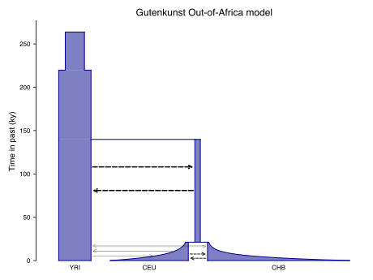

.. _sec_tutorial:

=============================
PORTING IN PROGRESS: Tutorial
=============================

Non-uniform recombination
-------------------------

The ``msprime`` API allows us to quickly and easily simulate data from an
arbitrary recombination map.
To do this, we can specify an external recombination map as a
:meth:`msprime.RecombinationMap` object.
We need to supply a list of ``positions`` in the map, and a list showing ``rates``
of crossover between each specified position.

In the example below, we specify a recombination map with distinct recombination rates between each 100th base.

.. code-block:: python

    # Making a simple RecombinationMap object.
    map_positions = [i*100 for i in range(0, 11)]
    map_rates = [0, 1e-4, 5e-4, 1e-4, 0, 0, 0, 5e-4, 6e-4, 1e-4, 0]
    my_map = msprime.RecombinationMap(map_positions, map_rates)
    # Simulating with the recombination map.
    ts = msprime.simulate(sample_size = 6, random_seed = 12, recombination_map = my_map)

The resulting tree sequence has no interval breakpoints between positions 400 and 700,
as our recombination map specified a crossover rate of 0 between these positions.

.. code-block:: python

    for tree in ts.trees():
        print("-" * 20)
        print("tree {}: interval = {}".format(tree.index, tree.interval))
        print(tree.draw(format="unicode"))

    # --------------------
    # tree 0: interval = (0.0, 249.0639823488891)
    #    11
    #  ┏━━┻━━┓
    #  ┃     9
    #  ┃   ┏━┻━┓
    #  8   ┃   ┃
    # ┏┻┓  ┃   ┃
    # ┃ ┃  ┃   7
    # ┃ ┃  ┃  ┏┻┓
    # ┃ ┃  6  ┃ ┃
    # ┃ ┃ ┏┻┓ ┃ ┃
    # 2 5 0 1 3 4
    #
    # --------------------
    # tree 1: interval = (249.0639823488891, 849.2285335049714)
    #    12
    # ┏━━━┻━━━┓
    # ┃      11
    # ┃    ┏━━┻━┓
    # ┃    9    ┃
    # ┃  ┏━┻━┓  ┃
    # ┃  ┃   7  ┃
    # ┃  ┃  ┏┻┓ ┃
    # ┃  6  ┃ ┃ ┃
    # ┃ ┏┻┓ ┃ ┃ ┃
    # 5 0 1 3 4 2
    #
    # --------------------
    # tree 2: interval = (849.2285335049714, 1000.0)
    #   12
    # ┏━━┻━━┓
    # ┃    11
    # ┃  ┏━━┻━┓
    # ┃  ┃   10
    # ┃  ┃  ┏━┻┓
    # ┃  ┃  ┃  7
    # ┃  ┃  ┃ ┏┻┓
    # ┃  6  ┃ ┃ ┃
    # ┃ ┏┻┓ ┃ ┃ ┃
    # 5 0 1 2 3 4

A more advanced example is included below.
In this example we read a recombination
map for human chromosome 22, and simulate a single replicate. After
the simulation is completed, we plot histograms of the recombination
rates and the simulated breakpoints. These show that density of
breakpoints follows the recombination rate closely.

.. code-block:: python

    import numpy as np
    import scipy.stats
    import matplotlib.pyplot as pyplot

    def variable_recomb_example():
        infile = "hapmap/genetic_map_GRCh37_chr22.txt"
        # Read in the recombination map using the read_hapmap method,
        recomb_map = msprime.RecombinationMap.read_hapmap(infile)

        # Now we get the positions and rates from the recombination
        # map and plot these using 500 bins.
        positions = np.array(recomb_map.get_positions()[1:])
        rates = np.array(recomb_map.get_rates()[1:])
        num_bins = 500
        v, bin_edges, _ = scipy.stats.binned_statistic(
            positions, rates, bins=num_bins)
        x = bin_edges[:-1][np.logical_not(np.isnan(v))]
        y = v[np.logical_not(np.isnan(v))]
        fig, ax1 = pyplot.subplots(figsize=(16, 6))
        ax1.plot(x, y, color="blue")
        ax1.set_ylabel("Recombination rate")
        ax1.set_xlabel("Chromosome position")

        # Now we run the simulation for this map. We simulate
        # 50 diploids (100 sampled genomes) in a population with Ne=10^4.
        tree_sequence = msprime.simulate(
            sample_size=100,
            Ne=10**4,
            recombination_map=recomb_map)
        # Now plot the density of breakpoints along the chromosome
        breakpoints = np.array(list(tree_sequence.breakpoints()))
        ax2 = ax1.twinx()
        v, bin_edges = np.histogram(breakpoints, num_bins, density=True)
        ax2.plot(bin_edges[:-1], v, color="green")
        ax2.set_ylabel("Breakpoint density")
        ax2.set_xlim(1.5e7, 5.3e7)
        fig.savefig("hapmap_chr22.svg")

.. image:: _static/hapmap_chr22.svg
   :width: 800px
   :alt: Density of breakpoints along the chromosome.

.. warning::
    Beware that this matrix might be very big (bigger than the tree
    sequence it's extracted from, in most realistically-sized
    simulations!)

.. _sec_tutorial_demography_complete_example:

******************
A complete example
******************

To illustrate ``msprime``'s demography API on a real example from the
literature, we implement the
`Gutenkunst et al. <http://dx.doi.org/10.1371/journal.pgen.1000695>`_
out-of-Africa model.
The parameter values used are taken from
`Table 1 <http://dx.doi.org/10.1371/journal.pgen.1000695.t001>`_.
Here is an illustration of the model using the `demography
package <https://github.com/apragsdale/demography>`__
(see also `Figure 2B <http://dx.doi.org/10.1371/journal.pgen.1000695.g002>`_
of the Gutenkunst et. al paper):

The code below is provided as an example to help you develop your
own models. If you want to use this precise model in your analyses
we strongly recommend using :ref:`stdpopsim <stdpopsim:sec_introduction>`,
which provides a community maintained :ref:`catalog <stdpopsim:sec_catalog>`
of simulation species information and demographic models. The
model given here is identical to the
:ref:`HomSam/OutOfAfrica_3G09 <stdpopsim:sec_catalog_homsap_models_outofafrica_3g09>`
model.

.. warning::

    The version of this model in the tutorial from 31 May 2016 to 29 May 2020
    (on the stable branch) was **incorrect**. Specifically, it mistakenly
    allowed for migration to continue beyond the merger of the African and
    Eurasian bottleneck populations. This has now been fixed, but if you had
    copied this model from the tutorial for your own analyses, you should
    update your model code or use the implementation that has been verified in
    :ref:`stdpopsim project <stdpopsim:sec_introduction>`. See `here
    <https://github.com/jeromekelleher/msprime-model-errors>`__ for more
    details on the faulty model and its likely effects on downstream analyses.

Coalescent simulation moves from the present back into the past,
so times are in units of generations *ago*, and we build the model
with most recent events first.

.. literalinclude:: examples/out_of_africa.py

Once we have defined the model, it is a *very* good idea to check
the implementation using the :class:`.DemographyDebugger`:

.. code-block:: python

    # Use the demography debugger to print out the demographic history
    # that we have just described.
    dd = msprime.DemographyDebugger(**out_of_africa())
    dd.print_history()

    # =============================
    # Epoch: 0 -- 848.0 generations
    # =============================
    #      start     end      growth_rate |     0        1        2
    #    -------- --------       -------- | -------- -------- --------
    # 0 |1.23e+04 1.23e+04              0 |     0      3e-05   1.9e-05
    # 1 |2.97e+04   1e+03           0.004 |   3e-05      0     9.6e-05
    # 2 |5.41e+04    510           0.0055 |  1.9e-05  9.6e-05     0
    #
    # Events @ generation 848.0
    #    - Mass migration: Lineages moved with probability 1.0 backwards in time with source 2 & dest 1
    #                      (equivalent to migration from 1 to 2 forwards in time)
    #    - Migration rate change to 0 everywhere
    #    - Migration rate change for (0, 1) to 0.00025
    #    - Migration rate change for (1, 0) to 0.00025
    #    - Population parameter change for 1: initial_size -> 2100 growth_rate -> 0
    # ==================================
    # Epoch: 848.0 -- 5600.0 generations
    # ==================================
    #      start     end      growth_rate |     0        1        2
    #    -------- --------       -------- | -------- -------- --------
    # 0 |1.23e+04 1.23e+04              0 |     0     0.00025     0
    # 1 | 2.1e+03  2.1e+03              0 |  0.00025     0        0
    # 2 |   510   2.27e-09         0.0055 |     0        0        0
    #
    # Events @ generation 5600.0
    #    - Mass migration: Lineages moved with probability 1.0 backwards in time with source 1 & dest 0
    #                    (equivalent to migration from 0 to 1 forwards in time)
    #    - Migration rate change to 0 everywhere
    # ===================================
    # Epoch: 5600.0 -- 8800.0 generations
    # ===================================
    #      start     end      growth_rate |     0        1        2
    #    -------- --------       -------- | -------- -------- --------
    # 0 |1.23e+04 1.23e+04              0 |     0        0        0
    # 1 | 2.1e+03  2.1e+03              0 |     0        0        0
    # 2 |2.27e-09 5.17e-17         0.0055 |     0        0        0
    #
    # Events @ generation 8800.0
    #    - Population parameter change for 0: initial_size -> 7300
    # ================================
    # Epoch: 8800.0 -- inf generations
    # ================================
    #      start     end      growth_rate |     0        1        2
    #    -------- --------       -------- | -------- -------- --------
    # 0 | 7.3e+03  7.3e+03              0 |     0        0        0
    # 1 | 2.1e+03  2.1e+03              0 |     0        0        0
    # 2 |5.17e-17     0            0.0055 |     0        0        0

Once you are satisfied that the demographic history that you have built
is correct, it can then be simulated by calling the :func:`.simulate`
function:

.. code-block:: python

    ts = msprime.simulate(**out_of_africa())

Comparing to analytical results
*******************************

.. todo:: It's not clear whether it's worth having this content
    here in the msprime repo or we should have a separate tutorial
    for this sort of thing as part of the "tutorials" section of the
    overall website.

A common task for coalescent simulations is to check the accuracy of analytical
approximations to statistics of interest. To do this, we require many independent
replicates of a given simulation. ``msprime`` provides a simple and efficient
API for replication: by providing the ``num_replicates`` argument to the
:func:`.simulate` function, we can iterate over the replicates
in a straightforward manner. Here is an example where we compare the
analytical results for the number of segregating sites with simulations:

.. literalinclude:: examples/segregating_sites.py

Running this code, we get:

.. code-block:: python

    segregating_sites(10, 5, 100000)
    #          mean              variance
    # Observed      14.17893          53.0746740551
    # Analytical    14.14484          52.63903

Note that in this example we set :math:`N_e = 0.5` and
the mutation rate to :math:`\theta / 2` when calling :func:`.simulate`.
This works because ``msprime`` simulates Kingman's coalescent,
for which :math:`N_e` is only a time scaling;
since :math:`N_e` is the diploid effective population size,
setting :math:`N_e = 0.5` means that the mean time for two samples to coalesce
is equal to one time unit in the resulting trees.
This is helpful for converting the diploid per-generation time units
of msprime into the haploid coalescent units used in many
theoretical results. However, it is important to note that conventions
vary widely, and great care is needed with such factor-of-two
rescalings.

In the following example, we calculate the mean coalescence time for
a pair of lineages sampled in different subpopulations in a symmetric island
model, and compare this with the analytical expectation.

.. literalinclude:: examples/migration.py

Again, we set :math:`N_e = 0.5` to agree with convention in theoretical results,
where usually one coalescent time unit is, in generations, the effective number of *haploid* individuals.
Running this example we get:

.. code-block:: python

    migration_example()
    # Observed  = 3.254904176088153
    # Predicted = 3.25

.. _sec_advanced_features:

Dead sections
*************
