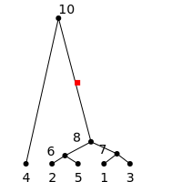
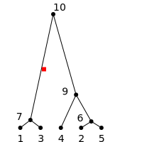
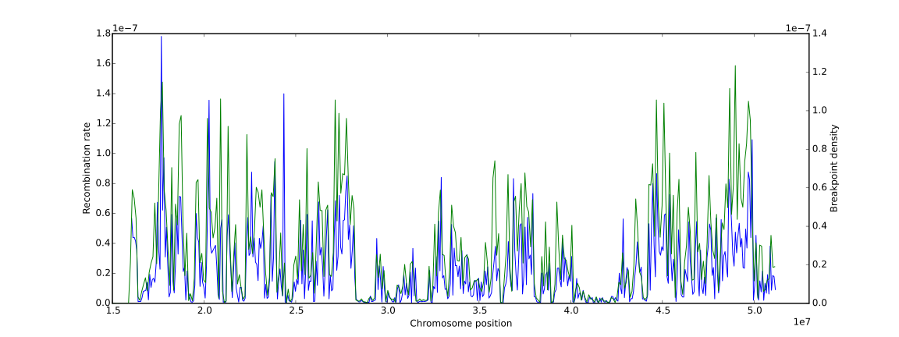
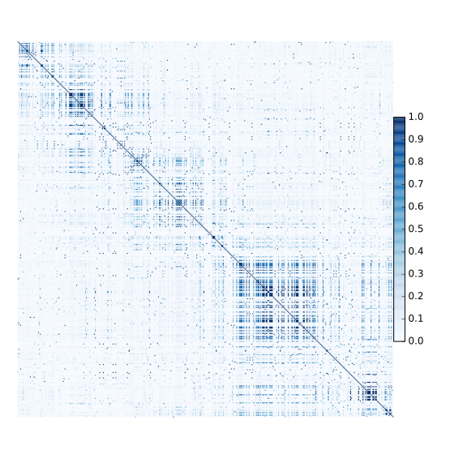

.. _sec-tutorial:

========
Tutorial
========

This is the tutorial for the Python interface to the ``msprime``
library. Detailed :ref:`sec-api` is also available for this
library. An :program:`ms`-compatible :ref:`command line interface <sec-cli>`
is also available if you wish to use ``msprime`` directly within
an existing work flow.

****************
Simulating trees
****************

Running simulations is very straightforward in ``msprime``::

    >>> import msprime
    >>> tree_sequence = msprime.simulate(sample_size=5, Ne=1000)
    >>> tree = next(tree_sequence.trees())
    >>> print(tree)
    {0: 5, 1: 7, 2: 5, 3: 7, 4: 6, 5: 6, 6: 8, 7: 8, 8: -1}

Here, we simulate the coalescent for a sample of size
5 with an effective population size of 1000,
and then print out a summary of the resulting tree. The
:func:`.simulate` function returns a
:class:`.TreeSequence` object, which provides a very
efficient way to access the correlated trees in simulations
involving recombination. In this example we know that
there can only be one tree because we have not provided
a value for ``recombination_rate``, and it
defaults to zero. Therefore, we access the only tree in the
sequence using the call ``next(tree_sequence.trees())``.

Trees are represented within ``msprime`` in a slightly unusual way. In
the majority of libraries dealing with trees, each node is
represented as an object in memory and the relationship
between nodes as pointers between these objects. In ``msprime``,
however, nodes are *integers*: the leaves (i.e., our sample) are the
integers :math:`0` to :math:`n - 1`, and every internal node is
some positive integer :math:`\geq n`. The result of printing
the tree is a summary of how these nodes relate to each other
in terms of their parents. For example, we can see that the parent
of nodes 1 and 3 is node 7.

This relationship can be seen more clearly in a picture:

This image shows the same tree as in the example but drawn out in
a more familiar format (images like this can be drawn for any
tree using the :meth:`~.SparseTree.draw` method).
We can see that the leaves of the tree
are labelled with 0 to 4, and all the internal nodes of the tree
are also integers with the root of the tree being 8. Also shown here
are the times for each internal node in generations. (The
time for all leaves is 0, and so we don't show this information
to avoid clutter.)

Knowing that our leaves are 0 to 4, we can easily trace our path
back to the root for a particular sample using the
:meth:`~.SparseTree.get_parent` method::

    >>> u = 0
    >>> while u != msprime.NULL_NODE:
    >>>     print("node {}: time = {}".format(u, tree.get_time(u)))
    >>>     u = tree.get_parent(u)
    node 0: time = 0.0
    node 5: time = 107.921165302
    node 6: time = 1006.74711128
    node 8: time = 1785.36352521

In this code chunk we iterate up the tree starting at node 0 and
stop when we get to the root. We know that a node is the root
if its parent is :const:`msprime.NULL_NODE`, which is a special
reserved node. (The value of the null node is -1, but we recommend
using the symbolic constant to make code more readable.) We also use
the :meth:`~.SparseTree.get_time` method to get the time
for each node, which corresponds to the time in generations
at which the coalescence event happened during the simulation.
We can also obtain the length of a branch joining a node to
its parent using the :meth:`~.SparseTree.get_branch_length`
method::

    >>> print(tree.get_branch_length(6))
    778.616413923

The branch length for node 6 is 778.6 generations as the time for
node 6 is 1006.7 and the time of its parent is 1785.4. It is also
often useful to obtain the total branch length of the tree, i.e.,
the sum of the lengths of all branches::

    >>> print(tree.get_total_branch_length())
    >>> 5932.15093686

*************
Recombination
*************

Simulating the history of a single locus is a very useful, but we are most
often interesting in simulating the history of our sample across large genomic
regions under the influence of recombination. The ``msprime`` API is
specifically designed to make this common requirement both easy and efficient.
To model genomic sequences under the influence of recombination we have
two parameters to the :func:`.simulate()` function.
The ``length`` parameter specifies the length of the simulated sequence
in bases, and may be a floating point number. If ``length`` is not
supplied, it is assumed to be 1. The ``recombination_rate``
parameter specifies the rate of crossing over per base per generation,
and is zero by default. See the :ref:`sec-api` for a discussion of the precise
recombination model used.

Here, we simulate the trees across over a 10kb region with a recombination
rate of :math:`2 \times 10^{-8}` per base per generation, with an
effective population size of 1000::

    >>> tree_sequence = msprime.simulate(
    ...    sample_size=5, Ne=1000, length=1e4, recombination_rate=2e-8)
    >>> for tree in tree_sequence.trees():
    ...    print(tree.get_interval(), str(tree), sep="\t")
    (0.0, 4701.4225005874)	{0: 6, 1: 5, 2: 6, 3: 9, 4: 5, 5: 7, 6: 7, 7: 9, 9: -1}
    (4701.4225005874, 10000.0)	{0: 6, 1: 5, 2: 6, 3: 8, 4: 5, 5: 8, 6: 9, 8: 9, 9: -1}

In this example, we use the :meth:`~.TreeSequence.trees`
method to iterate over the trees in the sequence. For each tree
we print out the interval the tree covers (i.e., the genomic
coordinates which all share precisely this tree) using the
:meth:`~.SparseTree.get_interval` method. Thus, the first tree covers the
first 4.7kb of sequence and the second tree covers the remaining 5.3kb.
We also print out the summary of each tree in terms of the parent values for
each tree. Again, these differences are best illustrated by
some images:

(We have suppressed the node time labels here for clarity.) We can see
that these trees share a great deal of their structure, but that there are
also important differences between the trees.

.. warning:: Do not store the values returned from the
    :meth:`~.TreeSequence.trees` iterator in a list and operate
    on them afterwards! For efficiency reasons ``msprime`` uses the same
    instance of :class:`.SparseTree` for each tree in the sequence
    and updates the internal state for each new tree. Therefore, if you store
    the trees returned from the iterator in a list, they will all refer
    to the same tree.

*********
Mutations
*********

Mutations are generated in ``msprime`` by throwing mutations down
on the branches of trees at a particular rate. The mutations are
generated under the infinite sites model, and so each mutation
occurs at a unique (floating point) point position along the
genomic interval occupied by a tree. The mutation rate for simulations
is specified using the ``mutation_rate`` parameter of
:func:`.simulate`. For example, to add some mutations
to our example above, we can use::

    >>> tree_sequence = msprime.simulate(
    ...    sample_size=5, Ne=1000, length=1e4, recombination_rate=2e-8, mutation_rate=2e-8)
    >>> print("Total mutations = ", tree_sequence.get_num_mutations())
    >>> for tree in tree_sequence.trees():
    >>>     print(tree.get_interval(), list(tree.mutations()), sep="\t")
    Total mutations =  1
    (0.0, 4701.4225005874)  []
    (4701.4225005874, 10000.0)      [Mutation(position=5461.212369738915, node=6, index=0)]

In this example (which has the same genealogies as our example above because
we use the same random seed), we have one mutation which
falls on the second tree. Mutations are represented as an object
with three attributes: ``position`` is the location of the mutation
in genomic coordinates, ``node`` is the node in the tree above which the
mutation occurs, and ``index`` is the (zero-based) index of the mutation
in the list. Positions are given as a floating point value as we are
using the infinite sites model. Every mutation falls on exactly one tree
and we obtain the mutations for a particular tree using the
:meth:`~.TreeSequence.mutations` method. Mutations are always returned
in increasing order of position. The mutation in this example is shown
as a red box on the corresponding branch:

We can calculate the allele frequency of mutations easily and
efficiently using the :meth:`~.SparseTree.get_num_leaves`
which returns the number of leaves underneath a particular node.
For example,::

    >>> for tree in tree_sequence.trees():
    ...    for position, node in tree.mutations():
    ...        print("Mutation @ position {} has frequency {}".format(
    ...            mutation.position,
    ...            tree.get_num_leaves(mutation.node) / tree.get_sample_size()))
    Mutation @ position 5461.21236974 has frequency 0.4

Sometimes we are only interested in a subset of the mutations
in a tree sequence. In these situations, it is useful (and efficient)
to update the tree sequence to only include the mutations we are
interested in using the :meth:`.TreeSequence.set_mutations` method.
Here, for example, we simulate some data and then retain only the
common variants where the allele frequency is greater than 0.5.

.. code-block:: python

    import msprime

    def set_mutations_example():
        tree_sequence = msprime.simulate(
            sample_size=10000, Ne=1e4, length=1e7, recombination_rate=2e-8,
            mutation_rate=2e-8)
        print("Simulated ", tree_sequence.get_num_mutations(), "mutations")
        common_mutations = []
        for tree in tree_sequence.trees():
            for mutation in tree.mutations():
                p = tree.get_num_leaves(mutation.node) / tree.get_sample_size()
                if p >= 0.5:
                    common_mutations.append(mutation)
        tree_sequence.set_mutations(common_mutations)
        print("Reduced to ", tree_sequence.get_num_mutations(), "common mutations")

Running this code, we get::

    >>> set_mutations_example()
    Simulated  78202 mutations
    Reduced to  5571 common mutations

********
Variants
********

We are often interesting in accessing the sequence data that results from
simulations directly. The most efficient way to do this is by using
the :meth:`.TreeSequence.variants` method, which returns an iterator
over all the variant objects arising from the trees and mutations.
Each variant contains all the information in a mutation object, but
also has the observed sequences for each sample in the ``genotypes``
field.

.. code-block:: python

    import msprime

    def variants_example():
        tree_sequence = msprime.simulate(
            sample_size=20, Ne=1e4, length=5e3, recombination_rate=2e-8,
            mutation_rate=2e-8, random_seed=10)
        print("Simulated ", tree_sequence.get_num_mutations(), "mutations")
        for variant in tree_sequence.variants():
            print(variant.index, variant.position, variant.genotypes, sep="\t")

In this example we simulate some data and then print out the observed
sequences. We loop through each variant and print out the observed state of
each sample as an array of zeros and ones, along with the index and position
of the corresponding mutation. (The default form for the
``genotypes`` array here is a :class:`numpy.ndarray`; however, the output can
also be a plain Python bytes object. See the :meth:`.TreeSequence.variants`
documentation for details.) Running the code, we get::

    >>> variants_example()
    Simulated  7 mutations
    0       2146.29801511   [0 0 1 0 0 0 0 0 0 0 0 0 0 0 0 0 0 0 0 0]
    1       2475.24314909   [0 0 0 0 0 0 0 0 1 0 0 0 0 0 0 0 0 0 0 0]
    2       3087.04505359   [0 1 0 0 0 0 1 0 0 0 0 0 0 0 0 0 0 0 0 0]
    3       3628.35359621   [1 0 1 1 1 1 0 1 1 1 1 1 1 1 1 1 1 1 1 1]
    4       4587.85827679   [0 0 0 0 0 1 1 0 1 0 0 1 0 1 0 0 0 0 0 0]
    5       4593.29453791   [1 0 1 0 0 1 1 1 1 1 1 1 1 1 1 1 1 0 1 1]
    6       4784.26662856   [0 0 0 0 0 0 0 0 1 0 0 0 0 0 0 0 0 0 0 0]

This way of working with the sequence data is quite efficient because we
do not need to keep the entire variant matrix in memory at once.

.. code-block:: python

    import msprime
    import numpy as np

    def variant_matrix_example():
        print("\nCreating full variant matrix")
        tree_sequence = msprime.simulate(
            sample_size=20, Ne=1e4, length=5e3, recombination_rate=2e-8,
            mutation_rate=2e-8, random_seed=10)
        shape = tree_sequence.get_num_mutations(), tree_sequence.get_sample_size()
        A = np.empty(shape, dtype="u1")
        for variant in tree_sequence.variants():
            A[variant.index] = variant.genotypes
        print(A)

In this example, we run the same simulation but this time
store entire variant matrix in a two-dimensional numpy array.
This is useful for integrating with tools such as
`scikit allel <https://scikit-allel.readthedocs.io/en/latest/>`_.::

    >>> variant_matrix_example()
    Creating full variant matrix
    [[0 0 1 0 0 0 0 0 0 0 0 0 0 0 0 0 0 0 0 0]
     [0 0 0 0 0 0 0 0 1 0 0 0 0 0 0 0 0 0 0 0]
     [0 1 0 0 0 0 1 0 0 0 0 0 0 0 0 0 0 0 0 0]
     [1 0 1 1 1 1 0 1 1 1 1 1 1 1 1 1 1 1 1 1]
     [0 0 0 0 0 1 1 0 1 0 0 1 0 1 0 0 0 0 0 0]
     [1 0 1 0 0 1 1 1 1 1 1 1 1 1 1 1 1 0 1 1]
     [0 0 0 0 0 0 0 0 1 0 0 0 0 0 0 0 0 0 0 0]]

******************
Historical samples
******************

Simulating coalescent histories in which some of the samples are not
from the present time is straightforward in ``msprime``.
By using the ``samples`` argument to :meth:`msprime.simulate`
we can specify the location and time at which all samples are made.

.. code-block:: python

    def historical_samples_example():
        samples = [
            msprime.Sample(population=0, time=0),
            msprime.Sample(0, 0),  # Or, we can use positional arguments.
            msprime.Sample(0, 3.0)
        ]
        tree_seq = msprime.simulate(samples=samples)
        tree = next(tree_seq.trees())
        for u in range(tree_seq.get_num_nodes()):
            print(u, tree.get_parent(u), tree.get_time(u), sep="\t")

In this example we create three samples, two taken at the present time
and one taken 1.0 generations in the past. There are a number of
different ways in which we can describe the samples using the
``msprime.Sample`` object (samples can be provided as plain tuples also
if more convenient). Running this example, we get::

    >>> historical_samples_example()
    0       3       0.0
    1       3       0.0
    2       4       1.0
    3       4       0.502039955384
    4       -1      4.5595966593

Because nodes ``0`` and ``1`` were sampled at time 0, their times in the tree
are both 0. Node ``2`` was sampled at time 1.0, and so its time is recorded
as 1.0 in the tree.

***********
Replication
***********

A common task for coalescent simulations is to check the accuracy of analytical
approximations to statistics of interest. To do this, we require many independent
replicates of a given simulation. ``msprime`` provides a simple and efficient
API for replication: by providing the ``num_replicates`` argument to the
:func:`.simulate` function, we can iterate over the replicates
in a straightforward manner. Here is an example where we compare the
analytical results for the number of segregating sites with simulations:

.. code-block:: python

    import msprime
    import numpy as np

    def segregating_sites_example(n, theta, num_replicates):
        S = np.zeros(num_replicates)
        replicates = msprime.simulate(
            sample_size=n,
            mutation_rate=theta / 4,
            num_replicates=num_replicates)
        for j, tree_sequence in enumerate(replicates):
            S[j] = tree_sequence.get_num_mutations()
        # Now, calculate the analytical predictions
        S_mean_a = np.sum(1 / np.arange(1, n)) * theta
        S_var_a = (
            theta * np.sum(1 / np.arange(1, n)) +
            theta**2 * np.sum(1 / np.arange(1, n)**2))
        print("              mean              variance")
        print("Observed      {}\t\t{}".format(np.mean(S), np.var(S)))
        print("Analytical    {:.5f}\t\t{:.5f}".format(S_mean_a, S_var_a))

Running this code, we get::

    >>> segregating_sites_example(10, 5, 100000)
                  mean                  variance
    Observed      14.12173		52.4695318071
    Analytical    14.14484		52.63903

Note that in this example we did not provide a value for the ``Ne``
argument to :func:`.simulate`. In this case the effective population
size defaults to 1, which can be useful for theoretical work. However,
it is essential to remember that all rates and times must still be
scaled by 4 to convert into the coalescent time scale.

********************
Population structure
********************

Population structure in ``msprime`` closely follows the model used in the
``ms`` simulator: we have :math:`N` demes with an :math:`N\times N`
matrix describing the migration rates between these subpopulations. The
sample sizes, population sizes and growth rates of all demes
can be specified independently. Migration rates are specified using
a migration matrix. Unlike ``ms`` however, all times and rates are specified
in generations and all populations sizes are absolute (that is, not
multiples of :math:`N_e`).

In the following example, we calculate the mean coalescence time for
a pair of lineages sampled in different demes in a symmetric island
model, and compare this with the analytical expectation.

.. code-block:: python

    import msprime
    import numpy as np

    def migration_example():
        # M is the overall symmetric migration rate, and d is the number
        # of demes.
        M = 0.2
        d = 3
        # We rescale m into per-generation values for msprime.
        m = M / (4 * (d - 1))
        # Allocate the initial sample. Because we are interested in the
        # between deme coalescence times, we choose one sample each
        # from the first two demes.
        population_configurations = [
            msprime.PopulationConfiguration(sample_size=1),
            msprime.PopulationConfiguration(sample_size=1),
            msprime.PopulationConfiguration(sample_size=0)]
        # Now we set up the migration matrix. Since this is a symmetric
        # island model, we have the same rate of migration between all
        # pairs of demes. Diagonal elements must be zero.
        migration_matrix = [
            [0, m, m],
            [m, 0, m],
            [m, m, 0]]
        # We pass these values to the simulate function, and ask it
        # to run the required number of replicates.
        num_replicates = 1e6
        replicates = msprime.simulate(
            population_configurations=population_configurations,
            migration_matrix=migration_matrix,
            num_replicates=num_replicates)
        # And then iterate over these replicates
        T = np.zeros(num_replicates)
        for i, tree_sequence in enumerate(replicates):
            tree = next(tree_sequence.trees())
            # Convert the TMRCA to coalecent units.
            T[i] = tree.get_time(tree.get_root()) / 4
        # Finally, calculate the analytical expectation and print
        # out the results
        analytical = d / 2 + (d - 1) / (2 * M)
        print("Observed  =", np.mean(T))
        print("Predicted =", analytical)

Running this example we get::

    >>> migration_example()
    Observed  = 6.50638181614
    Predicted = 6.5

**********
Demography
**********

Msprime provides a flexible and simple way to model past demographic events
in arbitrary combinations. Here is an example describing the
`Gutenkunst et al. <http://dx.doi.org/10.1371/journal.pgen.1000695>`_
out-of-Africa model. See
`Figure 2B <http://dx.doi.org/10.1371/journal.pgen.1000695.g002>`_
for a schematic of this model, and
`Table 1 <http://dx.doi.org/10.1371/journal.pgen.1000695.t001>`_ for
the values used.

.. todo:: Add a diagram of the model for convenience.

.. code-block:: python

    def out_of_africa():
        # First we set out the maximum likelihood values of the various parameters
        # given in Table 1.
        N_A = 7300
        N_B = 2100
        N_AF = 12300
        N_EU0 = 1000
        N_AS0 = 510
        # Times are provided in years, so we convert into generations.
        generation_time = 25
        T_AF = 220e3 / generation_time
        T_B = 140e3 / generation_time
        T_EU_AS = 21.2e3 / generation_time
        # We need to work out the starting (diploid) population sizes based on
        # the growth rates provided for these two populations
        r_EU = 0.004
        r_AS = 0.0055
        N_EU = N_EU0 / math.exp(-r_EU * T_EU_AS)
        N_AS = N_AS0 / math.exp(-r_AS * T_EU_AS)
        # Migration rates during the various epochs.
        m_AF_B = 25e-5
        m_AF_EU = 3e-5
        m_AF_AS = 1.9e-5
        m_EU_AS = 9.6e-5
        # Population IDs correspond to their indexes in the population
        # configuration array. Therefore, we have 0=YRI, 1=CEU and 2=CHB
        # initially.
        population_configurations = [
            msprime.PopulationConfiguration(
                sample_size=0, initial_size=N_AF),
            msprime.PopulationConfiguration(
                sample_size=1, initial_size=N_EU, growth_rate=r_EU),
            msprime.PopulationConfiguration(
                sample_size=1, initial_size=N_AS, growth_rate=r_AS)
        ]
        migration_matrix = [
            [      0, m_AF_EU, m_AF_AS],
            [m_AF_EU,       0, m_EU_AS],
            [m_AF_AS, m_EU_AS,       0],
        ]
        demographic_events = [
            # CEU and CHB merge into B with rate changes at T_EU_AS
            msprime.MassMigration(
                time=T_EU_AS, source=2, destination=1, proportion=1.0),
            msprime.MigrationRateChange(time=T_EU_AS, rate=0),
            msprime.MigrationRateChange(
                time=T_EU_AS, rate=m_AF_B, matrix_index=(0, 1)),
            msprime.MigrationRateChange(
                time=T_EU_AS, rate=m_AF_B, matrix_index=(1, 0)),
            msprime.PopulationParametersChange(
                time=T_EU_AS, initial_size=N_B, growth_rate=0, population_id=1),
            # Population B merges into YRI at T_B
            msprime.MassMigration(
                time=T_B, source=1, destination=0, proportion=1.0),
            # Size changes to N_A at T_AF
            msprime.PopulationParametersChange(
                time=T_AF, initial_size=N_A, population_id=0)
        ]
        # Use the demography debugger to print out the demographic history
        # that we have just described.
        dp = msprime.DemographyDebugger(
            Ne=N_A,
            population_configurations=population_configurations,
            migration_matrix=migration_matrix,
            demographic_events=demographic_events)
        dp.print_history()

The :class:`.DemographyDebugger` provides a method to debug the history that
you have described so that you can be sure that the migration rates, population
sizes and growth rates are all as you intend during each epoch::

    =============================
    Epoch: 0 -- 848.0 generations
    =============================
         start     end      growth_rate |     0        1        2
       -------- --------       -------- | -------- -------- --------
    0 |1.23e+04 1.23e+04              0 |     0      3e-05   1.9e-05
    1 |2.97e+04   1e+03           0.004 |   3e-05      0     9.6e-05
    2 |5.41e+04    510           0.0055 |  1.9e-05  9.6e-05     0

    Events @ generation 848.0
       - Mass migration: lineages move from 2 to 1 with probability 1.0
       - Migration rate change to 0 everywhere
       - Migration rate change for (0, 1) to 0.00025
       - Migration rate change for (1, 0) to 0.00025
       - Population parameter change for 1: initial_size -> 2100 growth_rate -> 0

    ==================================
    Epoch: 848.0 -- 5600.0 generations
    ==================================
         start     end      growth_rate |     0        1        2
       -------- --------       -------- | -------- -------- --------
    0 |1.23e+04 1.23e+04              0 |     0     0.00025     0
    1 | 2.1e+03  2.1e+03              0 |  0.00025     0        0
    2 |5.41e+04 2.41e-07         0.0055 |     0        0        0

    Events @ generation 5600.0
       - Mass migration: lineages move from 1 to 0 with probability 1.0

    ===================================
    Epoch: 5600.0 -- 8800.0 generations
    ===================================
         start     end      growth_rate |     0        1        2
       -------- --------       -------- | -------- -------- --------
    0 |1.23e+04 1.23e+04              0 |     0     0.00025     0
    1 | 2.1e+03  2.1e+03              0 |  0.00025     0        0
    2 |5.41e+04  0.00123         0.0055 |     0        0        0

    Events @ generation 8800.0
       - Population parameter change for 0: initial_size -> 7300

    ================================
    Epoch: 8800.0 -- inf generations
    ================================
         start     end      growth_rate |     0        1        2
       -------- --------       -------- | -------- -------- --------
    0 | 7.3e+03  7.3e+03              0 |     0     0.00025     0
    1 | 2.1e+03  2.1e+03              0 |  0.00025     0        0
    2 |5.41e+04     0            0.0055 |     0        0        0

.. warning:: The output of the :meth:`.DemographyDebugger.print_history` method
    is intended only for debugging purposes, and is not meant to be machine
    readable. The format is also preliminary; if there is other information
    that you think would be useful, please `open an issue on GitHub
    <https://github.com/jeromekelleher/msprime/issues>`_

Once you are satisfied that the demographic history that you have built
is correct, it can then be simulated by calling the :func:`.simulate`
function.

******************
Recombination maps
******************

The ``msprime`` API allows us to quickly and easily simulate data from an
arbitrary recombination map. In this example we read a recombination
map for human chromosome 22, and simulate a single replicate. After
the simulation is completed, we plot histograms of the recombination
rates and the simulated breakpoints. These show that density of
breakpoints follows the recombination rate closely.

.. code-block:: python

    import numpy as np
    import scipy.stats
    import matplotlib.pyplot as pyplot

    def variable_recomb_example():
        infile = "hapmap/genetic_map_GRCh37_chr22.txt"
        # Read in the recombination map using the read_hapmap method,
        recomb_map = msprime.RecombinationMap.read_hapmap(infile)

        # Now we get the positions and rates from the recombination
        # map and plot these using 500 bins.
        positions = np.array(recomb_map.get_positions()[1:])
        rates = np.array(recomb_map.get_rates()[1:])
        num_bins = 500
        v, bin_edges, _ = scipy.stats.binned_statistic(
            positions, rates, bins=num_bins)
        x = bin_edges[:-1][np.logical_not(np.isnan(v))]
        y = v[np.logical_not(np.isnan(v))]
        fig, ax1 = pyplot.subplots(figsize=(16, 6))
        ax1.plot(x, y, color="blue")
        ax1.set_ylabel("Recombination rate")
        ax1.set_xlabel("Chromosome position")

        # Now we run the simulation for this map. We assume Ne=10^4
        # and have a sample of 100 individuals
        tree_sequence = msprime.simulate(
            sample_size=100,
            Ne=10**4,
            recombination_map=recomb_map)
        # Now plot the density of breakpoints along the chromosome
        breakpoints = np.array(list(tree_sequence.breakpoints()))
        ax2 = ax1.twinx()
        v, bin_edges = np.histogram(breakpoints, num_bins, density=True)
        ax2.plot(bin_edges[:-1], v, color="green")
        ax2.set_ylabel("Breakpoint density")
        ax2.set_xlim(1.5e7, 5.3e7)
        fig.savefig("hapmap_chr22.svg")

**************
Calculating LD
**************

The ``msprime`` API provides methods to efficiently calculate
population genetics statistics. For example, the :class:`.LdCalculator`
class allows us to compute pairwise `linkage disequilibrium
<https://en.wikipedia.org/wiki/Linkage_disequilibrium>`_ coefficients.
Here we use the :meth:`.get_r2_matrix` method to easily make an
LD plot using `matplotlib <http://matplotlib.org/>`_. (Thanks to
the excellent `scikit-allel
<http://scikit-allel.readthedocs.io/en/latest/index.html>`_
for the basic `plotting code
<http://scikit-allel.readthedocs.io/en/latest/_modules/allel/stats/ld.html#plot_pairwise_ld>`_
used here.)

.. code-block:: python

    import msprime
    import matplotlib.pyplot as pyplot

    def ld_matrix_example():
        ts = msprime.simulate(100, recombination_rate=10, mutation_rate=20,
                random_seed=1)
        ld_calc = msprime.LdCalculator(ts)
        A = ld_calc.get_r2_matrix()
        # Now plot this matrix.
        x = A.shape[0] / pyplot.rcParams['savefig.dpi']
        x = max(x, pyplot.rcParams['figure.figsize'][0])
        fig, ax = pyplot.subplots(figsize=(x, x))
        fig.tight_layout(pad=0)
        im = ax.imshow(A, interpolation="none", vmin=0, vmax=1, cmap="Blues")
        ax.set_xticks([])
        ax.set_yticks([])
        for s in 'top', 'bottom', 'left', 'right':
            ax.spines[s].set_visible(False)
        pyplot.gcf().colorbar(im, shrink=.5, pad=0)
        pyplot.savefig("ld.svg")

.. _sec-tutorial-threads:

********************
Working with threads
********************

When performing large calculations it's often useful to split the
work over multiple processes or threads. The msprime API can
be used without issues across multiple processes, and the Python
:mod:`multiprocessing` module often provides a very effective way to
work with many replicate simulations in parallel.

When we wish to work with a single very large dataset, however, threads can
offer better resource usage because of the shared memory space. The Python
:mod:`threading` library gives a very simple interface to lightweight CPU
threads and allows us to perform several CPU intensive tasks in parallel. The
``msprime`` API is designed to allow multiple threads to work in parallel when
CPU intensive tasks are being undertaken.

.. note:: In the CPython implementation the `Global Interpreter Lock
   <https://wiki.python.org/moin/GlobalInterpreterLock>`_ ensures that
   only one thread executes Python bytecode at one time. This means that
   Python code does not parallelise well across threads, but avoids a large
   number of nasty pitfalls associated with multiple threads updating
   data structures in parallel. Native C extensions like ``numpy`` and ``msprime``
   release the GIL while expensive tasks are being performed, therefore
   allowing these calculations to proceed in parallel.

In the following example we wish to find all mutations that are in approximate
LD (:math:`r^2 \geq 0.5`) with a given set of mutations. We parallelise this
by splitting the input array between a number of threads, and use the
:meth:`.LdCalculator.get_r2_array` method to compute the :math:`r^2` value
both up and downstream of each focal mutation, filter out those that
exceed our threshold, and store the results in a dictionary. We also
use the very cool `tqdm <https://pypi.python.org/pypi/tqdm>`_ module to give us a
progress bar on this computation.

.. code-block:: python

    import threading
    import numpy as np
    import tqdm
    import msprime

    def find_ld_sites(
            tree_sequence, focal_mutations, max_distance=1e6, r2_threshold=0.5,
            num_threads=8):
        results = {}
        progress_bar = tqdm.tqdm(total=len(focal_mutations))
        num_threads = min(num_threads, len(focal_mutations))

        def thread_worker(thread_index):
            ld_calc = msprime.LdCalculator(tree_sequence)
            chunk_size = int(math.ceil(len(focal_mutations) / num_threads))
            start = thread_index * chunk_size
            for focal_mutation in focal_mutations[start: start + chunk_size]:
                a = ld_calc.get_r2_array(
                    focal_mutation, max_distance=max_distance,
                    direction=msprime.REVERSE)
                rev_indexes = focal_mutation - np.nonzero(a >= r2_threshold)[0] - 1
                a = ld_calc.get_r2_array(
                    focal_mutation, max_distance=max_distance,
                    direction=msprime.FORWARD)
                fwd_indexes = focal_mutation + np.nonzero(a >= r2_threshold)[0] + 1
                indexes = np.concatenate((rev_indexes[::-1], fwd_indexes))
                results[focal_mutation] = indexes
                progress_bar.update()

        threads = [
            threading.Thread(target=thread_worker, args=(j,))
            for j in range(num_threads)]
        for t in threads:
            t.start()
        for t in threads:
            t.join()
        progress_bar.close()
        return results

    def threads_example():
        ts = msprime.simulate(
            sample_size=1000, Ne=1e4, length=1e7, recombination_rate=2e-8,
            mutation_rate=2e-8)
        counts = np.zeros(ts.get_num_mutations())
        for t in ts.trees():
            for mutation in t.mutations():
                counts[mutation.index] = t.get_num_leaves(mutation.node)
        doubletons = np.nonzero(counts == 2)[0]
        results = find_ld_sites(ts, doubletons, num_threads=8)
        print(
            "Found LD sites for", len(results), "doubleton mutations out of",
            ts.get_num_mutations())

In this example, we first simulate 1000 samples of 10 megabases and find all
doubleton mutations in the resulting tree sequence. We then call the
``find_ld_sites()`` function to find all mutations that are within 1 megabase
of these doubletons and have an :math:`r^2` statistic of greater than 0.5.

The ``find_ld_sites()`` function performs these calculations in parallel using
8 threads. The real work is done in the nested ``thread_worker()`` function,
which is called once by each thread. In the thread worker, we first allocate an
instance of the :class:`.LdCalculator` class. (It is **critically important**
that each thread has its own instance of :class:`.LdCalculator`, as the threads
will not work efficiently otherwise.) After this, each thread works out the
slice of the input array that it is responsible for, and then iterates over
each focal mutation in turn. After the :math:`r^2` values have been calculated,
we then find the indexes of the mutations corresponding to values greater than
0.5 using :func:`numpy.nonzero`. Finally, the thread stores the resulting array
of mutation indexes in the ``results`` dictionary, and moves on to the next
focal mutation.

Running this example we get::

    >>> threads_example()
    100%|████████████████████████████████████████████████| 4045/4045 [00:09<00:00, 440.29it/s]
    Found LD sites for 4045 doubleton mutations out of 60100

